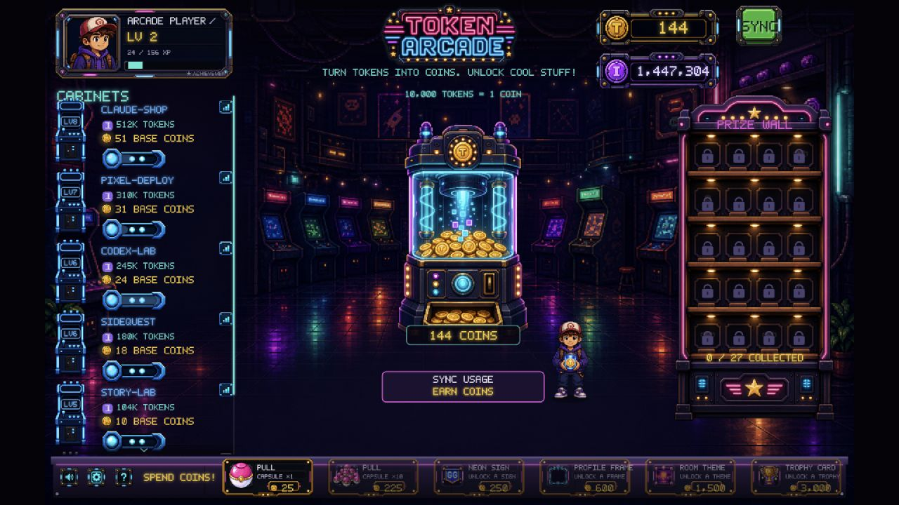
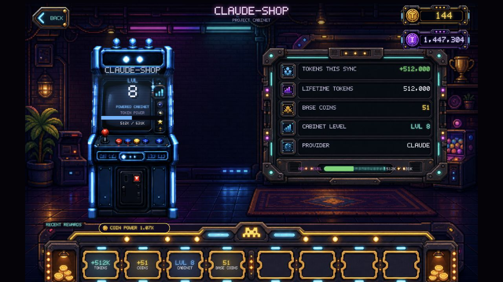
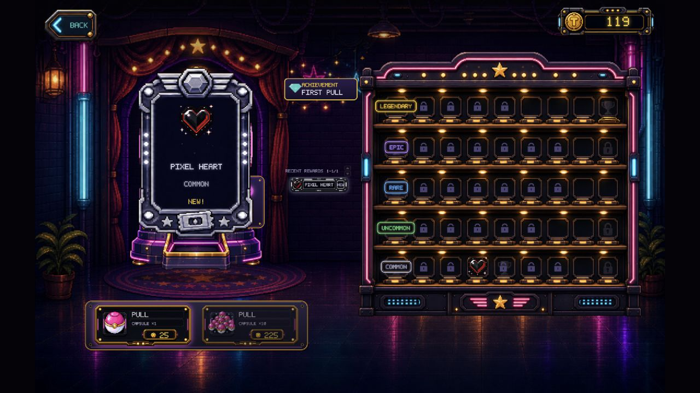
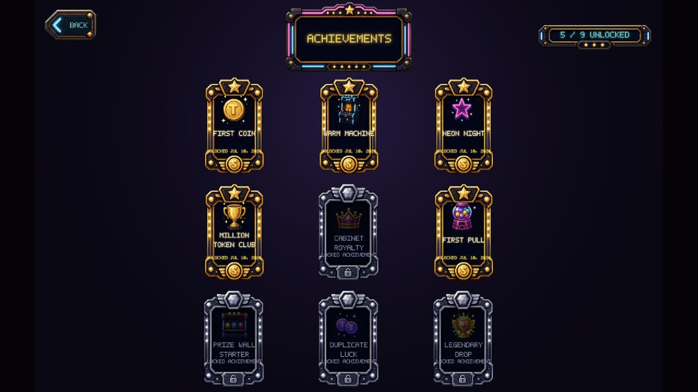

# Token Arcade

> Turn AI coding tokens into a tiny pixel arcade.

[](#status)
[](#run-locally)
[](#privacy)
[](LICENSE)

Token Arcade is a local-first game for Claude Code and Codex usage. It groups
your model token history by project, turns newly discovered tokens into arcade
coins, and lets you spend those coins on capsule pulls, collectibles, cabinets,
and achievements.



This is deliberately **not** a productivity dashboard. It does not score your
commits, tests, documentation, or output quality. Tokens are the only gameplay
input: use a model, sync your history, watch the arcade grow.

## Why Token Arcade

- **One honest input.** Token usage drives the entire game; there are no
  arbitrary productivity scores or judgments about how you work.
- **Every project becomes a cabinet.** More tokens unlock richer machine stages,
  brighter lights, and a visible history of the project growing.
- **Progress turns into a collection.** Coins fund capsule pulls, 50 collectible
  prizes, achievements, room themes, profile frames, and permanent display upgrades.
- **Your history stays yours.** Scanning, aggregation, saves, and demo data all
  remain on your machine with no account, telemetry, or cloud backend.

## Status

**V0.1 local release.** The first complete arcade loop is ready to play: sync
real local usage or deliberately enter an isolated demo, earn coins, level
project cabinets, collect all 50 prizes, unlock permanent collection upgrades,
and equip room themes and profile frames. Token Arcade remains a local-first
preview rather than a hosted service.

## Demo

All screenshots below use isolated, fictional demo data. No personal projects
or local usage history are included.

### A Project Becomes A Cabinet

Each project has a physical machine, token total, cabinet level, base coin
value, provider, and recent reward rail.



### Spend Coins, Fill The Wall

Capsule pulls add collectibles to the display and award achievements without
turning duplicate drops into a slow, blocking card queue.



### Achievements Have A Place To Live

The collection is a trophy gallery, not a list of browser cards.



## The Loop

```text
Use Claude Code or Codex
        ↓
Sync local token history
        ↓
Mint arcade coins
        ↓
Level up project cabinets
        ↓
Pull capsules and fill the prize wall
```

## What Is Here

- Local token-history scans for Claude Code and Codex, grouped by project.
- A single token-to-coin economy: `10,000 tokens = 1 coin`.
- Fifty cabinet levels across five visual stages.
- Fifty collectible prizes with four permanent prize-wall upgrades at 10, 25,
  40, and 50 unique discoveries.
- Capsule pulls, duplicate handling, a reviewable x10 result ticker, and a
  physical 50-slot prize cabinet.
- Unlockable room themes and profile frames with persistent equipped states.
- Achievement gallery and Simplified Chinese / English interface switching.
- An explicit no-history choice plus separate demo and live save slots, so
  fictional progress never leaks into real usage.
- Pixel-art canvas UI, bitmap font, sound feedback, and no account or cloud service.

## Run Locally

Requirements: Node.js 22+ and npm.

```bash
git clone https://github.com/Kevin9703/token-arcade.git
cd token-arcade
npm install
npm run dev
```

Then open [http://localhost:4173](http://localhost:4173).

Use `SYNC` to scan local usage. If no readable history is available, the app
can be explored in demo mode. Progress stays in browser `localStorage` on your
machine.

Useful commands:

```bash
npm run build
npm run typecheck
npm test
# with npm run dev running in another terminal:
node scripts/verify.mjs
```

## Privacy

The app binds its server to `127.0.0.1`. It reads local Claude Code/Codex
history only to aggregate token totals by project; it does not upload history,
send telemetry, require an account, or expose the scanner to your network.

For token accounting details and the project identity rules, read
[ARCHITECTURE.md](ARCHITECTURE.md#token-counting).

## Project Docs

- [Product brief](docs/PRODUCT_BRIEF.md)
- [MVP specification](docs/MVP_SPEC.md)
- [Game economy](docs/GAME_ECONOMY.md)
- [Project level system](docs/PROJECT_LEVEL_SYSTEM.md)
- [P1 trust and cosmetic progression](docs/P1_PRODUCT_SPEC.md)
- [P1 collection asset map](docs/P1C_COLLECTION_ASSETS.md)
- [Architecture](ARCHITECTURE.md)
- [PM release readiness review](docs/PM_RELEASE_READINESS_2026-07-10.md)

## Non-Goals

- No productivity score, rankings, or quality judgment.
- No real-money currency, paid currency, ads, accounts, or leaderboards.
- No chat transcript viewer.
- No combat RPG or dungeon-crawler mechanics.

## License

[MIT](LICENSE)
