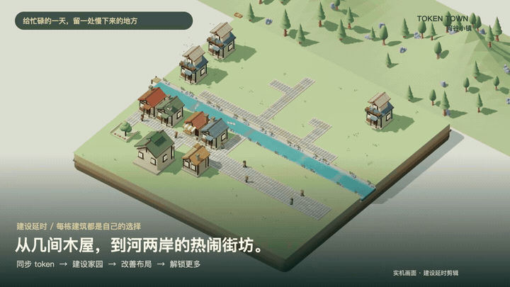

# Token Town · 河谷小镇

把 AI coding token 变成建设资金，在一片 3D 河谷里经营自己的小镇。每次玩 5–10 分钟，规划街道和社区，看村民种麦、养牛、钓鱼、做饭与分享收获，让小镇随着昼夜和四季慢慢生长。



<details>
<summary>▶ 播放 71 秒完整实机演示（含音乐）</summary>

从房屋搭建到种麦、磨面、烤面包，再看昼夜与四季更替。建设和农事经过剪辑，时光片段采用快进展示。

https://github.com/user-attachments/assets/a5018820-21eb-449f-9b86-f09a19549827

</details>

**同步 token → 获得金币 → 建设与布置 → 改善居民服务 → 完成委托 → 解锁土地、建筑和装饰。**

## 本地运行

需要 Node.js 22+。

```bash
npm install
npm run dev
```

打开 [河谷小镇](http://127.0.0.1:4173)。真实模式通过本地服务读取 Claude Code / Codex / Kimi Code / DeepSeek Harness 使用记录；没有历史记录也可以接通起步街道、游玩免费规划关，或选择演示城镇。

[演示城镇](http://127.0.0.1:4173/?demo=1) 提供四个虚构项目。首次同步得到 400 金币，之后每次模拟使用增加 80 金币。演示和真实进度分别保存。

## 开始建设

1. 同步使用记录，兑换建设金币。
2. 打开建设目录，选择建筑或直接拖出目录。预览模型跟随指针，Q / E 调整朝向，点击或松开拖动放下。
3. 给建筑门口接上道路，连通镇公所。选中建筑可以查看入口、服务范围、容量和缺少服务的原因。
4. 改善住宅的食物、绿地和休闲需求，完成委托，逐步开放新土地和建筑。
5. 尝试六张免费规划关：用固定建筑和道路额度挑战更好的布局，解锁装饰蓝图与配色。

起步套件包含镇公所、四栋住宅、面包店和公园。建筑立即落成，购买的实例永久保留；铺路、搬迁、旋转、收纳和重新摆放都免费。

## 居民服务怎么算

委托进度统计**获得服务的住宅数量**，同一栋住宅的同一项需求只计一次。增加商店或公园后，需要让更多住宅真正获得服务，进度才会提高。

- **连路：**住宅和服务设施的入口必须通过道路接到镇公所；旋转建筑也会改变入口。
- **食物：**面包店最多服务 6 栋住宅，入口之间的最短道路距离不超过 8 格；集市最多服务 12 栋，距离不超过 12 格。
- **休闲：**咖啡馆最多服务 8 栋住宅，最短道路距离不超过 18 格。
- **绿地：**公园须连路，住宅和公园占地最近边缘的曼哈顿距离不超过 6 格即可覆盖。

住宅屋顶的需求气泡直接标出未满足项，点击可以定位。主城第五章不限制道路数量；免费规划关仍保留有限道路挑战，咖啡馆为 10 格 / 4 户、公园为 3 格。

商店优先分配给道路距离较近的住宅；距离相同时按稳定建筑编号分配。果蔬铺、花艺店和书屋有各自的容量与距离，可在建筑详情查看。多个设施覆盖同一住宅不会叠加进度，纯装饰也不会提供居民服务。

## 农事、昼夜与四季

在建设目录的「农事」中购买河岸麦田（6 金币）和风车磨坊（32 金币），将它们与住宅、面包店一起接到镇公所道路网络。最多三位村民参与生产：

**播种 → 生长 → 收割 → 运麦 → 磨面 → 送粉 → 烘焙。**

每批 2 小麦加工成 3 面粉，2 份用于烤成 4 面包，剩余面粉可送往饭馆。村民沿道路运输，作物、货物和磨坊叶片会随生产变化；农事面板显示库存以及断路、缺设施、缺居民或缺原料的原因。磨面需要 5 秒，烘焙需要 3 秒，工作须等村民到达。农事库存独立于住宅服务计算，面包不兑换金币。

第二章开始可布置菜地、牛棚、猪圈、河边钓鱼小屋和饭馆。菜地选择土豆或胡萝卜；牛棚提供鲜奶并可加工奶酪，小猪寻松露，村民在码头抛竿收鱼。原料沿道路送到饭馆，选择浓汤、奶酪拼盘或炖鱼菜谱。最多三位邻居轮流承担农事、加工和配送。

打开「邻里」，准备面包篮、河畔野餐或秋日丰收会。完成时消耗真实材料，首次解锁围裙架、野餐长桌或麦穗旗蓝图；重复完成记录分享次数，不发金币，没有限时和取消惩罚。蓝图在建设目录购买。

六分钟过一天，每三天换一季。夏天麦子长得更快，冬天更慢。春季胡萝卜、夏季土豆较快，秋季蔬菜增产，冬季露天菜地休耕而温室继续种菜；村民晚上开门回家睡觉，清晨出门继续工作。夜间和道路中断会暂停生产，恢复后续做。时间和农事进度自动保存，离开游戏不计算离线产出。

四季分别播放轻音乐，切换季节和循环播放时平滑淡入淡出。音乐在首次操作后开始播放，设置中可单独开关和调整音量，也可以固定时段或季节。

## 操作

| 操作 | 控制方式 |
|---|---|
| 放置建筑 | 选择或拖出目录，预览跟随指针，点击 / 拖放落地 |
| 旋转待放建筑 | Q / E；R 也可旋转 |
| 取消放置 | Esc / 右键 |
| 平移镜头 | WASD；浏览时按下拖动，摆放时中键拖动 |
| 连续旋转镜头 | 浏览时按住 Q / E 或镜头旋转按钮，松开停止 |
| 触控板调整视角 | 两指上下滑改变俯仰，左右滑旋转 |
| 触控板缩放 / 平移 | 捏合缩放；Shift + 两指滑动平移 |
| 鼠标缩放 | 设置切换为鼠标模式后，滚轮缩放 |
| 查看建筑 | 点击建筑，查看详情与服务覆盖 |
| 认识村民 | 浏览时点击人物，或打开邻里 → 认识街坊；查看名字、简介、当前行动、去向和住处，行动实时更新 |
| 观察钓鱼 | 农事或钓鱼小屋详情中点击「看看码头」，镜头转到河面一侧；查看实际工人和等待 / 暂停原因 |
| 纯享模式 | 点击镜头栏的眼睛或按 H，隐藏全部界面；H / Esc 恢复 |
| 街道视角 | 点击脚印或按 V，从村民高度走进街道；WASD 行走，拖动 / 两指滑动观察，Q/E 转向，Esc 返回 |
| 收起目标卡 | 点击卡片右上角关闭按钮；点击「展开目标」恢复，刷新后保留偏好 |

WASD 在摆放建筑时也可移动镜头，速度随缩放调整（默认视距每秒 12 格），输入框中不会拦截文字输入。精确格子输入可作为辅助放置方式。普通镜头可放大至 5.5 倍、压低至 12°。默认均衡画质为 30 帧，保留抗锯齿与柔和阴影；精细为 60 帧，省电关闭阴影。后台页面暂停渲染和生产。设置也提供总静音和减少动态效果。

## 当前内容

- 40 × 40 河谷地图：河岸街区、草甸台地和东侧高地，起步开放南岸前 26 列土地，随六章委托继续扩展。林地河湾、丘陵、码头与野花围绕城镇，缓坡可以修路，平整台地可以建设。
- 六章主城发展、六张独立规划关、永久星级，以及挑战装饰蓝图和配色。规划关使用独立地图与固定库存，不消耗主城金币；重复通关可以改善星级。
- 住宅、镇公所、面包店、咖啡馆、集市、果蔬铺、花艺店、书屋、麦田、风车磨坊、饭馆、菜地、牛棚、猪圈、钓鱼小屋、石桥和钟楼，以及可种植的温室、粮仓、船屋等建筑。
- 树木、长椅、路灯、花箱、喷泉、凉亭、绿篱、手推车等街道和庭院装饰。
- 每个 AI 项目一栋免费工坊，50 级、5 个视觉阶段，可自由摆放或收纳。
- Three.js 正交建设镜头、透视街道视角与纯享模式、原创完整 3D 建筑、柔和阴影、暖色窗灯、石板道路、流水、浅滩、芦苇、水鸭和林地。
- 村民错峰逛店、坐下休息、务农配送、分享收获、夜间回家，以及建筑落成、同步到账和阶段完成反馈。
- 本地自动存档、备份导入导出、跨窗口进度保护，以及分别保存的真实 / 演示城镇。

## 金币、存档与隐私

每 10,000 新 token 兑换 1 金币，不足一枚的零头继续累计。首次同步可以兑换已有历史；之后按每个项目的兑换高水位计算增量，重复同步或历史减少后恢复都不会重复发币。工坊等级没有金币倍率。

六章基础委托分别提供 5 / 10 / 15 / 20 / 25 / 30 金币的补贴权益，只领取一次。累计实际补贴最多为累计 token 金币的 20%；额度不足的部分保留，后续同步再补发。没有维护费或离线惩罚。

本地服务仅监听 `127.0.0.1`，通过 `GET /api/usage` 提供聚合结果。只汇总项目名称、来源和 token 数量，不展示完整对话，不上传使用历史，也不根据提交、测试、PR 或工作质量发放奖励。

存档保存在当前浏览器的 `tokenTown.slot.live.v1` / `tokenTown.slot.demo.v1` 中。更换浏览器或本地地址前，可以在设置中导出备份；导入时需要使用对应的真实或演示模式。

### 新增 coding agent 的本地目录

默认扫描 Kimi Code 的 `~/.kimi-code`，兼容旧 Kimi CLI 的 `~/.kimi`；自定义数据目录可用 `KIMI_CODE_HOME` / `KIMI_SHARE_DIR`。DeepSeek Harness 默认读取 `~/.dsh/sessions`，支持 `DSH_HOME`，也可用 `TOKEN_TOWN_DSH_SESSIONS` 指定会话目录。压缩 `.jsonl.zstd` 会话与迁移版本自动识别。

只按实际调用使用量计入，排除缓存命中、继承上下文和重复副本。同一项目的多个 agent 合并到原工坊；原项目 ID 和已兑换高水位保留。可读取的数据格式与边界见 [本地扫描口径](ARCHITECTURE.md#本地扫描口径)。

## 开发与验证

```bash
npm run typecheck
npm test
npm run build
```

`npm run build` 生成 3D 资产、前端与本地服务；构建后用 `npm run start` 启动。开发时可在另一个终端运行 `npm run watch`，监听前端源码变化。

游戏规则独立于场景渲染。规则测试覆盖金币高水位、零头累计、补贴、道路与服务分配、建筑占地、库存、存档、章节和关卡解法；动画与交互测试覆盖村民交通、坐姿、昼夜出入、农事暂停恢复和镜头控制。浏览器验收应使用独立地址或测试存档，保留玩家进度。

## 资料与授权

- [文档导航](docs/README.md)
- [游戏规则、章节与规划关](docs/TOKEN_TOWN.md)
- [当前架构](ARCHITECTURE.md)
- [3D 资产与 Blender 工作流](docs/TOWN_3D_ASSETS.md)
- [验收记录](docs/QA.md)
- [开发路线图与完成状态](docs/ROADMAP.md)
- [游戏开发约定](AGENTS.md)
- [音乐曲目、来源与授权](public/assets/town/audio/CREDITS.md)
- [宣传片录制与剪辑](docs/PROMO.md)

代码与原创模型使用 MIT 许可。导入的 Kenney 植物和道具使用 CC0，来源与原许可随资产保留。四季音乐由 Kevin MacLeod 创作，使用 CC BY 4.0；录音本地随游戏提供，曲目、署名及改动记录见音乐说明。
