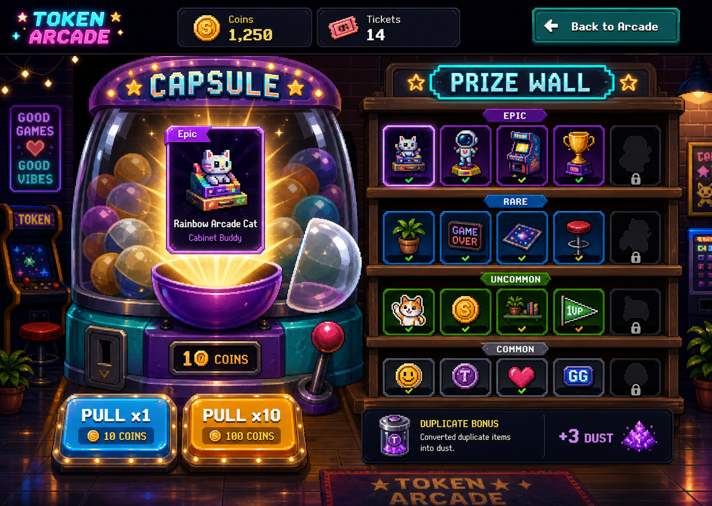
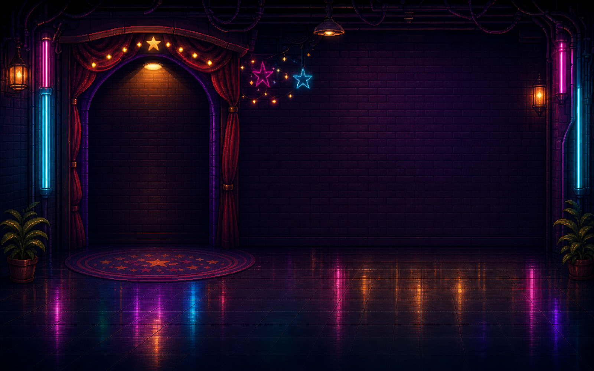
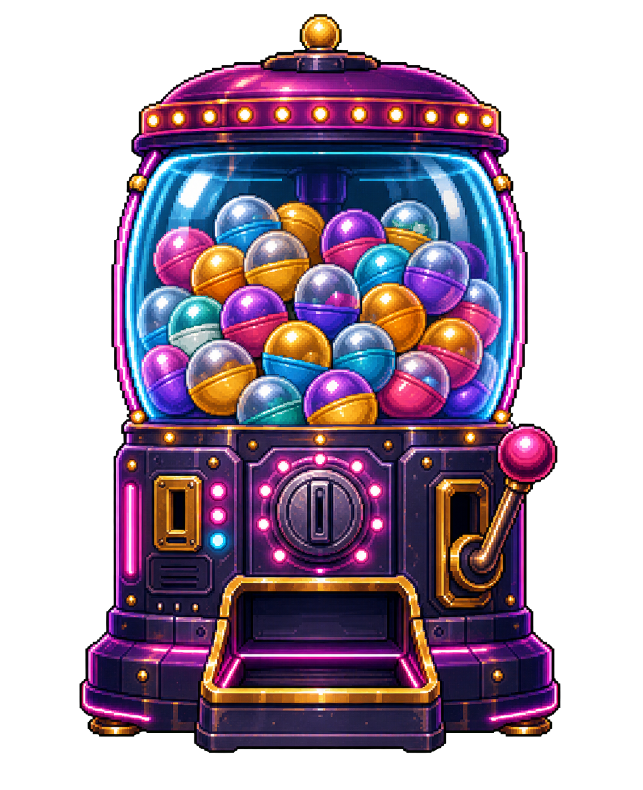
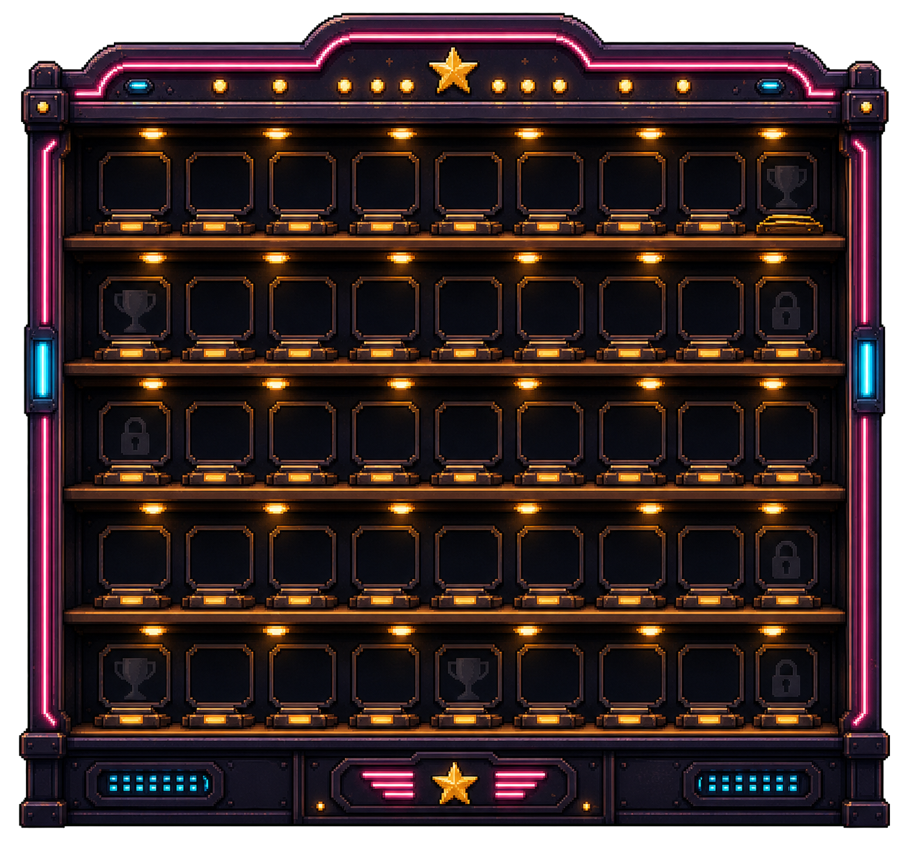
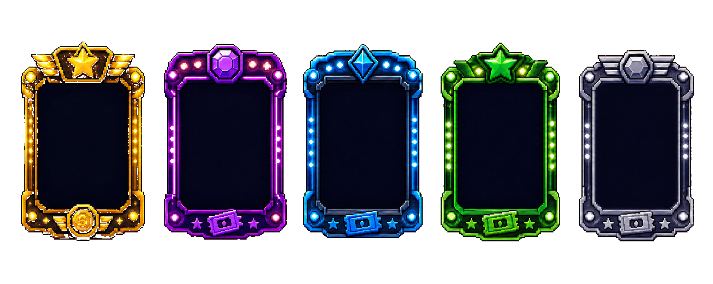

# Capsule And Achievement Display Assets

Date: 2026-07-08

This page is the visual brief for the capsule machine and achievement display pass.

Historical browser evidence was reviewed during the original visual pass. Its
temporary screenshot archive was intentionally removed during repository
cleanup; the asset brief and acceptance direction below remain authoritative.

Reference direction:



## PM Verdict

The current capsule page is functional, but it does not feel like a reward room yet.

The left machine is too procedural, the right side reads like a rarity table, the empty dark background has little arcade depth, and the giant `INSERT COIN` label dominates the screen instead of making the pull feel tempting.

The next pass should not add new game systems. It should make the existing coin sink feel like the place where token spend turns into prizes.

## Generated Assets

### Capsule Reward Room Background



Path:

```text
assets/generated/capsule/capsule-room-bg-v2-empty-1600x1000.png
```

Use:

- Draw this as the capsule screen background.
- Keep dynamic counters, buttons, locks, rarity labels, and collectible state code-rendered above it.
- Do not cover the room with a large opaque panel.
- Let the left prize corner and right trophy cabinet create the screen structure.

Important:

- This asset is exactly `1600x1000`.
- It intentionally does not contain a capsule machine or achievement cabinet. Treat it as an empty room backdrop for separately composited foreground assets.

### Premium Capsule Machine



Path:

```text
assets/generated/capsule/capsule-machine-v1.png
```

Source:

```text
assets/generated/capsule/source/capsule-machine-v1-chroma.png
```

Use:

- Replace the current procedural capsule machine with this transparent PNG.
- Scale it into the left action area, roughly `430-520` logical pixels tall depending on final layout.
- Keep pull behavior, shake feedback, affordability state, and button hit areas unchanged.
- Keep labels and prices code-rendered. Do not bake readable UI text into the image.

Important:

- The machine should be the emotional center of the page.
- The pull buttons should feel mounted to the machine counter or floor, not floating below a huge text label.

### Achievement Display Cabinet



Path:

```text
assets/generated/capsule/achievement-display-v1.png
```

Source:

```text
assets/generated/capsule/source/achievement-display-v1-chroma.png
```

Use:

- Use this as the right-side collection display cabinet.
- Render owned collectibles, locked silhouettes, duplicate counts, and rarity accents on top.
- The current rarity groups can remain in data, but the screen should visually read as shelves in a trophy cabinet instead of rows in a table.
- Rarity labels should be small plaques or shelf markers, not section headers that dominate the cabinet.

Important:

- Empty slots must still feel desirable.
- The cabinet should make `0 / N collected` feel like an invitation, not a blank spreadsheet.

### Reward Reveal Card Frames



Path:

```text
assets/generated/capsule/reveal-card-frames-v2-transparent.png
public/assets/capsule/reveal-frames.png
```

Source:

```text
assets/generated/capsule/source/reveal-card-frames-v2-red-source.png
```

Use:

- Use this as a rarity frame sheet for reveal cards.
- Prefer the pre-cropped transparent single-frame files when drawing cards:
  - `public/assets/capsule/reveal-frame-legendary.png`
  - `public/assets/capsule/reveal-frame-epic.png`
  - `public/assets/capsule/reveal-frame-rare.png`
  - `public/assets/capsule/reveal-frame-uncommon.png`
  - `public/assets/capsule/reveal-frame-common.png`
- Draw the collectible sprite, name, rarity, and duplicate/new state inside the frame.
- The current reveal timing can remain simple.

Important:

- The uncommon frame should be a clear green frame. Do not use the old transparent/dark-looking uncommon frame, and do not recolor it in code.

- Pulling should have a short prize moment: machine shakes, glow burst appears near the mouth, reveal card pops above the machine or between machine and cabinet.
- The reveal card should not look like a generic modal.

## Required Layout Direction

Keep the same screen purpose:

```text
left: capsule machine and pull action
right: achievement / collection display cabinet
top: currency counters
bottom or machine base: pull buttons
```

But change the feeling:

- The screen is a reward room, not a settings page.
- The capsule machine is a physical object.
- The right side is a lit trophy cabinet.
- Pulling is the primary action, so the eye should naturally land on the machine, then the button, then the reveal.
- The `INSERT COIN` concept can exist as a small machine label, but it must not be giant foreground text that overlaps the room.

## Integration Guidance For Claude Code

- Do not add new product mechanics.
- Preserve current pull costs, currency counters, owned collectible state, duplicate handling, achievements, and routing.
- Add asset loading with graceful fallback if an image fails.
- Keep all important UI text code-rendered.
- Use assets as background/object layers, then draw state-driven information on top.
- Avoid full-screen opaque panels over the generated background.
- Avoid recreating the current right-side rarity table with decorative art behind it.

## Acceptance Criteria

- The capsule screen feels like a prize corner inside the same arcade world as the home screen.
- The left machine looks premium enough that the user wants to press pull.
- The right collection area reads as an achievement display cabinet, not a table.
- Empty locked slots still look collectible and desirable.
- The reveal card has rarity-specific visual energy.
- Text remains readable at desktop and mobile canvas sizes.
- The implementation is closer to `assets/prototypes/capsule-prize-wall.png` than to the current screenshot.

## PM Note

The bar is not "make the capsule page prettier."

The bar is:

```text
Would someone spend coins just to see this machine animate and add something to that cabinet?
```
