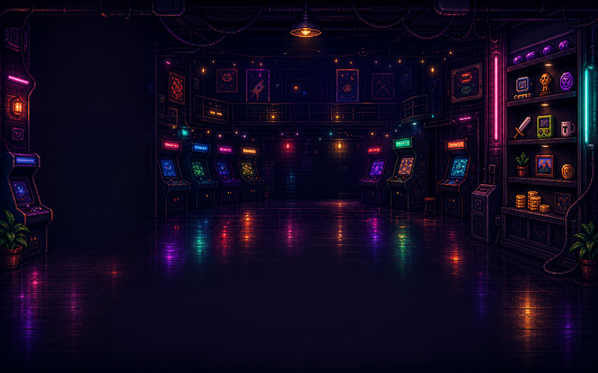
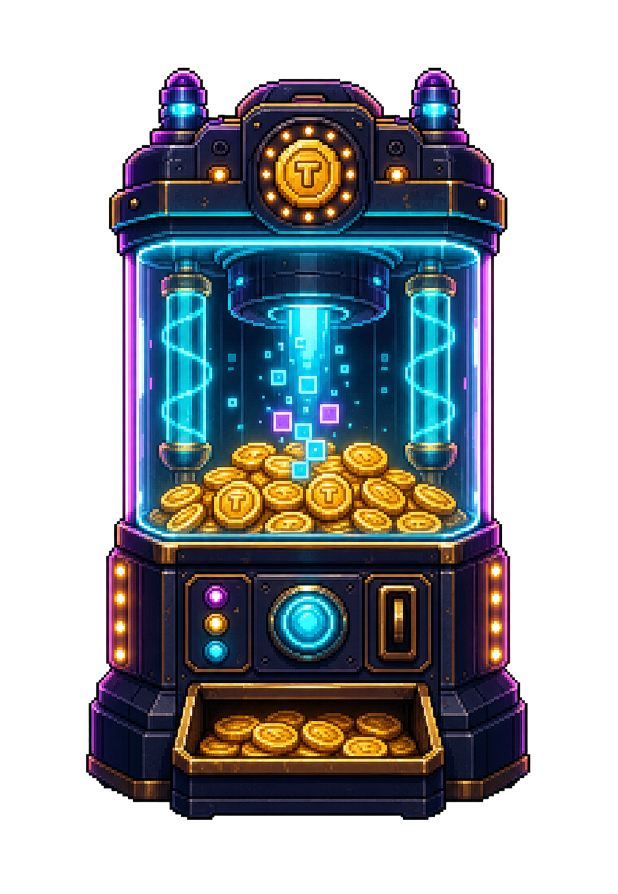
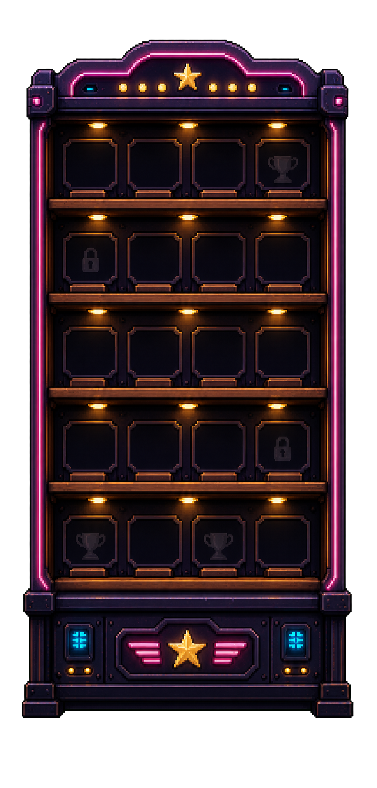
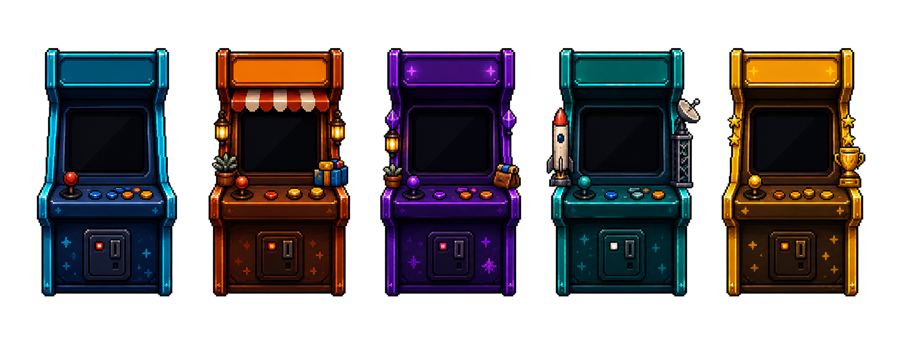

# Generated Visual Assets

Date: 2026-07-08

These assets are for the next visual quality pass.

The product standard is `assets/prototypes/primary-arcade-room.png`. The current implementation has the right structure, but it needs stronger room depth, object quality, and reward desirability.

## Assets

### Arcade Room Background



Path:

```text
assets/generated/arcade-room-bg-v1-1600x1000.png
```

Use:

- Draw as the home screen background before UI objects.
- Keep the current code-rendered player card, cabinet data, coin balance, and controls above it.
- This asset is exactly 1600x1000.

Important:

- Do not cover the whole room with opaque panels.
- Let the wall, floor reflections, shelves, and distant machines show through.

### Coin Bank Machine



Path:

```text
assets/generated/coin-bank-v1.png
```

Source:

```text
assets/generated/source/coin-bank-v1-chroma.png
```

Use:

- Replace or enhance the current procedural coin bank.
- Keep code-rendered dynamic text and numbers on top or nearby.
- Scale to fit the existing center region, roughly `360x520` logical pixels.

Important:

- This object should be the most tempting thing on the home screen.
- Preserve click/sync behavior.

### Prize Wall



Path:

```text
assets/generated/prize-wall-v1.png
```

Source:

```text
assets/generated/source/prize-wall-v1-chroma.png
```

Use:

- Replace or enhance the current prize wall frame.
- Render owned/locked collectible state with code on top of the shelf slots.
- Scale/crop carefully to fit the current right column, roughly `360x750` logical pixels.

Important:

- The wall should feel desirable even at `0 / 27 collected`.
- Avoid turning it into a plain grid again.

### Cabinet Skins



Path:

```text
assets/generated/cabinet-skins-v1.png
```

Source:

```text
assets/generated/source/cabinet-skins-v1-chroma.png
```

Use:

- Use as a cabinet skin sheet or crop into individual cabinet sprites.
- Keep project names, level, tokens, coin yield, and progress bars code-rendered.
- Match projects to cabinet themes when possible:
  - cyan lab
  - orange shop
  - purple sidequest
  - teal deploy
  - gold trophy

Important:

- The left column should stop feeling like a data list.
- Each project should feel like a physical arcade cabinet.

## PM Requirements For The Next Visual Pass

The next visual pass should not add new game features. It should make the existing loop feel much more premium.

Required improvements:

- The home screen must feel like a room, not a flat UI.
- The coin bank must become the visual centerpiece.
- The prize wall must feel like a collectible shelf.
- Project cabinets must feel more physical and varied.
- Text must remain readable.
- No important text should be baked into image assets.

## Capsule And Achievement Display Assets

The capsule machine and achievement display page has a separate visual brief:

```text
docs/CAPSULE_GENERATED_ASSETS.md
```

Use that brief for the next capsule screen pass. The current capsule page should become a reward room with a premium machine, a lit achievement cabinet, and rarity-specific reveal card frames.

## Project Detail Assets

The project cabinet detail page has a separate visual brief:

```text
docs/PROJECT_DETAIL_GENERATED_ASSETS.md
```

Use that brief for the next project-detail pass. The current project page should become a physical cabinet inspection bay with a large selected cabinet, a wall-mounted stats board, and a recent rewards rail. It must support multiple large cabinet color variants, not only the green one.

Primary large cabinet stage assets:

```text
public/assets/project-detail/cabinet-stage-1.png
public/assets/project-detail/cabinet-stage-2.png
public/assets/project-detail/cabinet-stage-3.png
public/assets/project-detail/cabinet-stage-4.png
public/assets/project-detail/cabinet-stage-5.png
```

Use these transparent single-cabinet assets for the project detail page's main cabinet stage art. Do not build the main project-detail cabinet by pasting a tiny crown/topper onto an older cabinet, and do not crop the full sheet at runtime. The cabinet should change as a whole machine across the five stages.

## Project Level System Assets

The project cabinet level system has a separate product and visual brief:

```text
docs/PROJECT_LEVEL_SYSTEM.md
```

Use that brief for the next level-system pass. Projects should support 50 numeric levels and 5 visual stages. The large project cabinet variants should map to level stages, and the home-screen project cabinets should use the same stage language instead of reading as unrelated random colors.

Level UI kit:

```text
assets/generated/level-system/home-level-cabinets-v5-redrawn.png
public/assets/level-system/home-level-cabinets.png
assets/generated/level-system/project-level-ui-kit-v6-counted-lights.png
public/assets/level-system/project-level-ui-kit.png
```

Source:

```text
assets/generated/level-system/source/home-level-cabinets-v5-redrawn-chroma.png
assets/generated/level-system/source/project-level-ui-kit-v6-counted-lights-chroma.png
```

Use `home-level-cabinets.png` for level-colored home project cabinets. Use `project-level-ui-kit.png` for stage badges, cabinet toppers, progress-meter endcaps, level-up sparkles, and max-level shine. Keep level numbers, project names, token totals, progress, and coin values code-rendered.

For the large project-detail cabinet, use `public/assets/project-detail/cabinet-stage-1.png` through `cabinet-stage-5.png` instead of composing an older cabinet with the topper/badge/endcap kit. The badge/topper kit is still useful for reward wall, achievement showcase, hover details, and small UI accents.

Stage-light rule:

- Topper front-strip bulbs must count 1, 2, 3, 4, 5 across the five visual stages.
- Progress-meter endcap lights should echo the same 1-5 count.
- Decorative crown gems stay for richness, but the countable signal is the front-strip bulb row.
- The replacement sprite sheets have new dimensions and need fresh crop measurements.

## Home UI Redesign Assets

The home screen has a separate prototype-alignment brief:

```text
docs/HOME_VISUAL_REDESIGN_FROM_PROTOTYPE.md
```

Use that brief to bring the home screen back toward the original arcade-game UI quality. The new assets are empty containers where dynamic text and values should be code-rendered on top.

Primary home UI assets:

```text
public/assets/home-ui/logo-sign-v1-trimmed.png
public/assets/home-ui/player-character-v1-trimmed.png
public/assets/home-ui/player-card-frame-v1-trimmed.png
public/assets/home-ui/coin-counter-plaque-v1-trimmed.png
public/assets/home-ui/sync-button-states-v2-trimmed.png
public/assets/home-ui/shop-card-frame-v1-trimmed.png
public/assets/home-ui/project-row-frame-v1-trimmed.png
public/assets/home-ui/icon-button-frame-v1-trimmed.png
```

Review contact sheet:

```text
docs/homepage-redesign-assets/home-ui-assets-contact-sheet-v1.png
```

Source:

```text
assets/generated/home-ui/source/
```

Do not use the rejected green-key sync button version:

```text
assets/generated/home-ui/rejected/sync-button-states-v1-bad-green-key.png
```

## Collectible And Currency Icon Assets

The collectible icon pass has a separate asset and implementation brief:

```text
docs/COLLECTIBLE_GENERATED_ASSETS.md
```

Use these generated icons to replace the rough code-drawn collectible sprites in reveal cards, prize-wall slots, tooltips, shop cards, and achievement cards where appropriate.

Individual item icons:

```text
public/assets/collectibles/items/
```

Transparent sheets:

```text
public/assets/collectibles/sheets/currency-icons-v1.png
public/assets/collectibles/sheets/common-icons-v1.png
public/assets/collectibles/sheets/uncommon-icons-v1.png
public/assets/collectibles/sheets/rare-icons-v1.png
public/assets/collectibles/sheets/epic-icons-v1.png
public/assets/collectibles/sheets/legendary-icons-v1.png
```

Review contact sheet:

```text
docs/collectible-assets/collectible-items-contact-sheet-v1.png
```

Source:

```text
assets/generated/collectibles/source/
```

## Achievement Showcase Assets

Use these assets to replace the current code-drawn achievement cards and icons.
The page should read as an arcade trophy display / achievement cabinet, not a
plain web card grid.

Individual transparent PNGs:

```text
public/assets/achievement-showcase/items/title_plaque.png
public/assets/achievement-showcase/items/card_unlocked.png
public/assets/achievement-showcase/items/card_locked.png
public/assets/achievement-showcase/items/icon_niche.png
public/assets/achievement-showcase/items/small_plaque.png
public/assets/achievement-showcase/items/back_button.png
public/assets/achievement-showcase/items/progress_plaque.png
public/assets/achievement-showcase/items/ach_first_coin.png
public/assets/achievement-showcase/items/ach_warm_machine.png
public/assets/achievement-showcase/items/ach_neon_night.png
public/assets/achievement-showcase/items/ach_million.png
public/assets/achievement-showcase/items/ach_royalty.png
public/assets/achievement-showcase/items/ach_first_pull.png
public/assets/achievement-showcase/items/ach_wall_starter.png
public/assets/achievement-showcase/items/ach_dupe_luck.png
public/assets/achievement-showcase/items/ach_legendary_drop.png
```

The individual runtime PNGs above are the source of truth. The temporary
review contact sheet was removed during repository cleanup.

Source:

```text
assets/generated/achievement-showcase/source/
```

## HUD And Project Detail Icon Assets

Use these assets to replace old/code-drawn coin counters, price tags, project
stat icons, and recent reward/milestone icons.

Individual transparent PNGs:

```text
public/assets/hud/items/coin_hud_plaque.png
public/assets/hud/items/token_hud_plaque.png
public/assets/hud/items/price_tag_plaque.png
public/assets/hud/items/coin_socket.png
public/assets/hud/items/reward_ticket_frame.png
public/assets/hud/items/stat_tokens_sync.png
public/assets/hud/items/stat_lifetime_tokens.png
public/assets/hud/items/stat_coins_minted.png
public/assets/hud/items/stat_cabinet_level.png
public/assets/hud/items/stat_provider.png
public/assets/hud/items/stat_coin_power.png
public/assets/hud/items/stat_recent_token.png
public/assets/hud/items/stat_recent_coin.png
```

The individual runtime PNGs above are the source of truth. The temporary
review contact sheet was removed during repository cleanup.

Source:

```text
assets/generated/hud/source/
```

## Shop Capsule Icons

Use these to replace the procedural capsule icon in the bottom shop rail.

Individual transparent PNGs:

```text
public/assets/shop/items/shop_capsule_single.png
public/assets/shop/items/shop_capsule_bundle.png
```

Mapping:

```text
pull1  -> shop_capsule_single.png
pull10 -> shop_capsule_bundle.png
```

Review contact sheet:

```text
docs/shop-assets/shop-capsule-icons-contact-sheet-v1.png
```

Implementation brief:

```text
docs/SHOP_CAPSULE_GENERATED_ASSETS.md
```

## Home Logo Flicker Frames

Use these to animate the main `TOKEN ARCADE` home sign without code-drawing the
logo.

```text
public/assets/home-ui/logo-sign-flicker-dropout-v1.png
public/assets/home-ui/logo-sign-flicker-burst-v1.png
```

Review contact sheet:

```text
docs/home-ui-assets/logo-flicker-contact-sheet-v1.png
```

Implementation brief:

```text
docs/HOME_LOGO_FLICKER_ASSETS.md
```

## Acceptance Test

Open the home screen and compare it with:

```text
assets/prototypes/primary-arcade-room.png
```

The implementation does not need to copy the prototype exactly, but it should match its product fantasy:

```text
The player has entered a cozy arcade where their AI token spend becomes coins,
their projects become machines, and rewards visibly accumulate on the wall.
```
