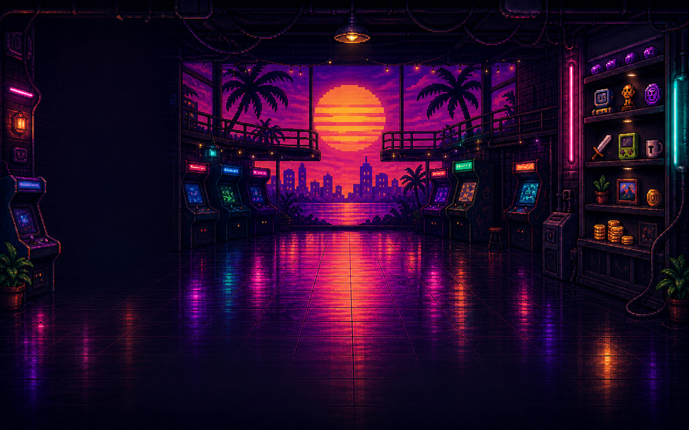
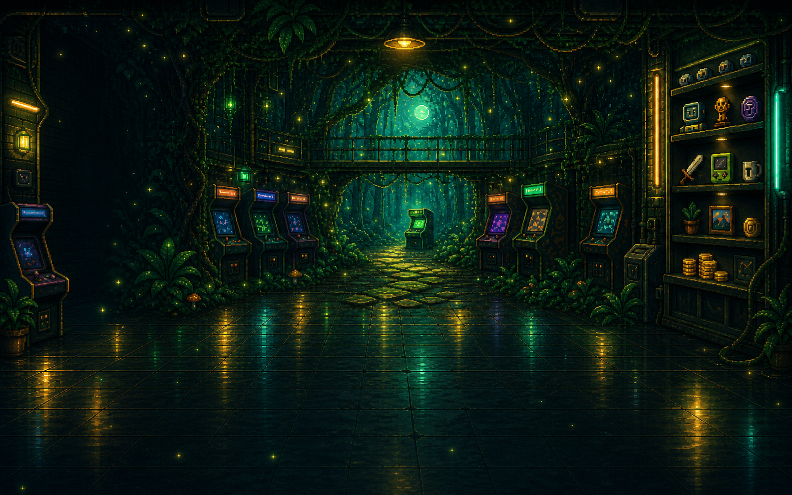

# P1 Cosmetic Assets

Date: 2026-07-10

These are final P1 theme background assets. They are intentionally derived
from the corresponding collectible cards, not generic recolors of the arcade.

## Final Assets

### Sunset Room Theme



```text
assets/generated/p1-customization/sunset-arcade-room-bg-v1.png
```

Runtime destination:

```text
public/assets/customization/sunset-arcade-room-bg-v1.png
```

Use only when the player equips `e_sunset` (`Sunset Room Theme`). It extends
the item's purple/magenta vaporwave sky, orange striped sun, palm silhouettes,
city skyline, and reflective floor into the Home room.

### Forest Room Theme



```text
assets/generated/p1-customization/forest-arcade-room-bg-v1.png
```

Runtime destination:

```text
public/assets/customization/forest-arcade-room-bg-v1.png
```

Use only when the player equips `l_forest` (`Forest Room Theme`). It extends
the item's emerald forest clearing, fireflies, stone path, green cabinet, and
legendary gold accents into the Home room.

### Cyan Profile Frame

This is an existing runtime collectible, not a new redraw:

```text
public/assets/collectibles/items/r_frame.png
```

Use only when the player equips `r_frame` (`Cyan Profile Frame`). It must wrap
the Home player portrait as a complete asset: winged cyan diamond at the top,
lower diamond socket, and four blue corner bolts all remain visible.

## Non-Negotiable Placement Rules

- Full-room themes are opaque backgrounds behind the Home scene. Do not crop,
  tint, recolor, or paint over them in code.
- Keep the existing foreground coin bank, player, HUD, cabinet list, prize
  wall, marquee, shop rail, and all dynamic text above the background.
- Do not add baked text, buttons, player art, or counters to the background.
- Do not use the Sunset background for any other theme or the Forest background
  for any other theme.
- The profile frame is an overlay around the avatar portrait, not a card
  background and not a thin cyan border.

See `docs/P1_COSMETIC_ART_DIRECTION.md` for the full visual contract.
