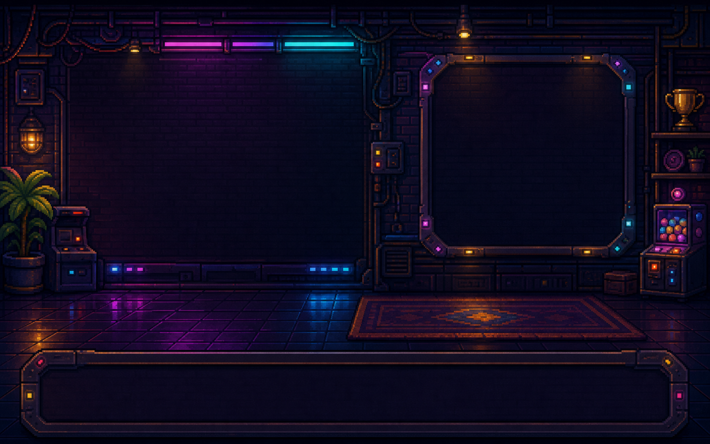
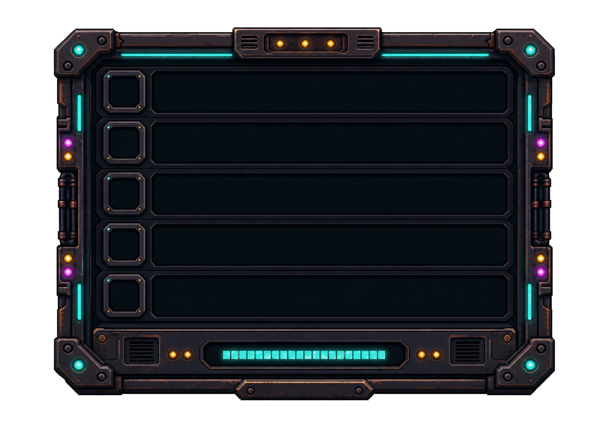
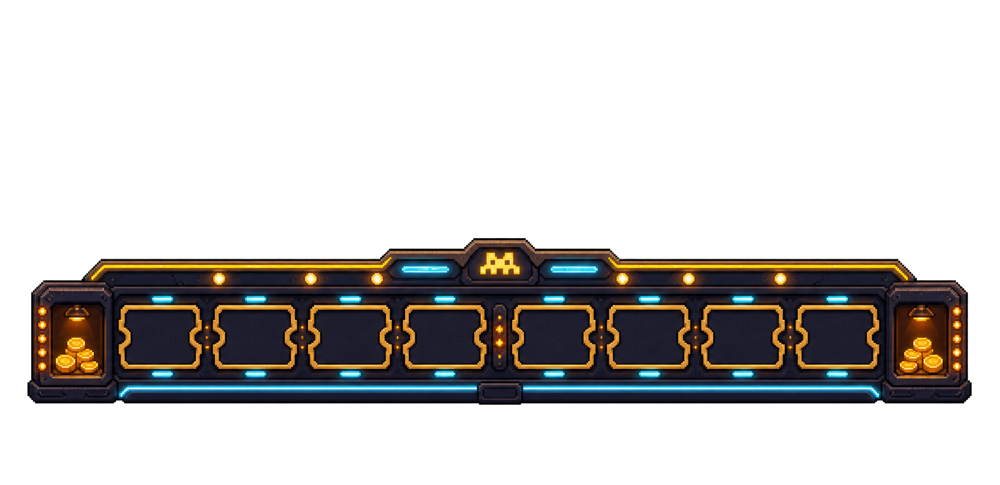

# Project Detail Generated Assets

Date: 2026-07-08

These assets are for the project cabinet detail screen.

The product target is still `assets/prototypes/project-cabinet-detail.png`: clicking a project should feel like walking up to that project's personal arcade cabinet, not opening a stats dashboard.

## Product Goal

The current project detail screen has the right information, but it reads too much like a large cabinet beside a UI stats card.

This pass should turn it into a physical arcade inspection bay:

```text
selected project cabinet
-> cabinet power / lifetime tokens / coins minted
-> next level preview
-> recent reward tickets
```

The user should feel that every project is a different machine in their arcade.

## Assets

### Project Room Background



Path:

```text
assets/generated/project-detail/project-room-bg-v1-1600x1000.png
public/assets/project-detail/room-bg.png
```

Use:

- Draw behind the project detail screen.
- Keep the left side open for the large cabinet.
- Keep the right wall area for stats and level progress.
- Keep the bottom rail area for recent rewards.

Important:

- Do not cover the background with large opaque UI panels.
- The wall frame and bottom strip are environmental anchors, not final UI by themselves.

### Large Project Cabinet Stage Assets

Use these as the primary project-detail cabinet art:

```text
public/assets/project-detail/cabinet-stage-1.png
public/assets/project-detail/cabinet-stage-2.png
public/assets/project-detail/cabinet-stage-3.png
public/assets/project-detail/cabinet-stage-4.png
public/assets/project-detail/cabinet-stage-5.png
```

These are five pre-cropped transparent cabinet PNGs. They should replace the older direction of composing an old cabinet plus a small topper/badge, and they should also replace runtime cropping from the full sheet.

The project detail page must not use only the green cabinet. The selected cabinet should map to the project's level stage so the detail page and home screen share the same growth language.

| Stage | Levels | Cabinet Feeling |
| ---: | --- | --- |
| 1 | 1-4 | white-silver starter cabinet, 1 top-slot light |
| 2 | 5-9 | blue powered cabinet, 2 top-slot lights |
| 3 | 10-19 | magenta deluxe cabinet, crown-shaped top, 3 top-slot lights |
| 4 | 20-34 | purple neon cabinet, large jewel top and side wings, 4 top-slot lights |
| 5 | 35-50 | amber legendary trophy cabinet, huge crown and trophy wings, 5 top-slot lights |

Do not use the green cabinet as one of the 5 level stages unless the stage system is deliberately redesigned. Stage 1 is white/silver, Stage 2 is blue.

Use:

- Draw the selected project's cabinet as the main left-side object.
- Choose the pre-cropped cabinet image by project level stage, as specified in `docs/PROJECT_LEVEL_SYSTEM.md`.
- Keep the project name, level, token power, progress, and any screen scene code-rendered.
- Use monitor/screen areas as code-drawn surfaces only where it improves the page.

Important:

- Do not bake project names or numbers into the image.
- Do not collapse every project to the same green cabinet.
- The selected detail cabinet should visually match or echo the smaller cabinet seen on the home screen.
- Do not paste a tiny crown sticker onto an old base cabinet. For higher stages, the crown/top structure must read as part of the cabinet silhouette.
- Do not crop the full stage sheet at runtime. Stage 5 uses a wider transparent asset so its crown wings stay intact.

### Project Stats Board



Path:

```text
assets/generated/project-detail/project-stats-board-v1.png
public/assets/project-detail/stats-board.png
```

Use:

- Replace the plain right-side stats card with this physical maintenance board frame.
- Render labels and values in code on top of the five empty rows.
- Keep existing stats:
  - tokens this sync
  - lifetime tokens
  - coins minted
  - cabinet level
  - provider
  - next level progress

Important:

- This should feel like a lit arcade maintenance panel, not a SaaS table.
- Keep text readable and aligned with the inset rows.
- Avoid drawing another opaque rounded rectangle over the asset.

### Recent Rewards Rail



Path:

```text
assets/generated/project-detail/recent-rewards-rail-v1.png
public/assets/project-detail/recent-rewards-rail.png
```

Use:

- Replace the current bottom UI strip with a physical ticket/conveyor rail.
- Render recent coin/token events as tickets or chips sitting in the empty slots.
- If no recent rewards exist, show empty ticket slots rather than a blank UI card.

Important:

- Recent rewards are secondary. They should add life without stealing focus from the cabinet.
- Keep any reward amounts and timestamps code-rendered.

## Source Images

The chroma-key source files are preserved here:

```text
assets/generated/project-detail/source/
```

Use the processed transparent PNGs above for the app. The source files are only for future regeneration or cleanup.

## Layout Guidance

Target composition:

```text
top left: back button
top center: project name / small Token Arcade sign
top right: coins and lifetime tokens

left: large selected project cabinet
right: physical project stats board
bottom: recent rewards rail
```

Recommended behavior:

- Preserve the existing route and project data.
- Preserve all current numeric logic.
- Use generated assets as visual layers.
- Keep text, hit areas, progress, lock/unlock state, and data values in code.
- Keep fallback procedural rendering if assets fail to load.

## Acceptance Criteria

The page passes visual QA when:

- It no longer reads as a generic project stats UI.
- The selected project feels like a personal arcade cabinet.
- Different projects can show different large cabinet colors.
- The right stats area feels like a wall-mounted machine panel.
- The bottom recent rewards area feels like physical prize tickets or chips.
- The screen still explains the project-level token loop at a glance.

The intended feeling:

```text
This project has its own machine. More tokens power it up, mint coins,
and slowly turn it into a more impressive cabinet.
```
