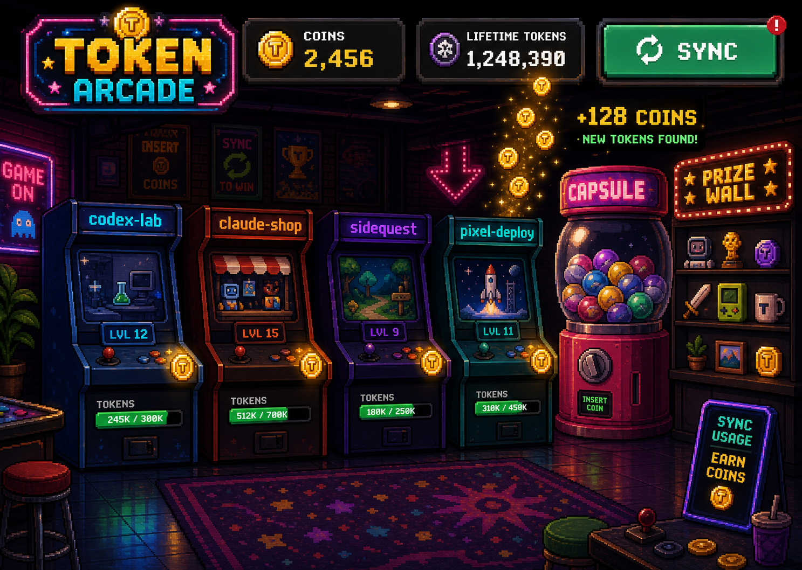
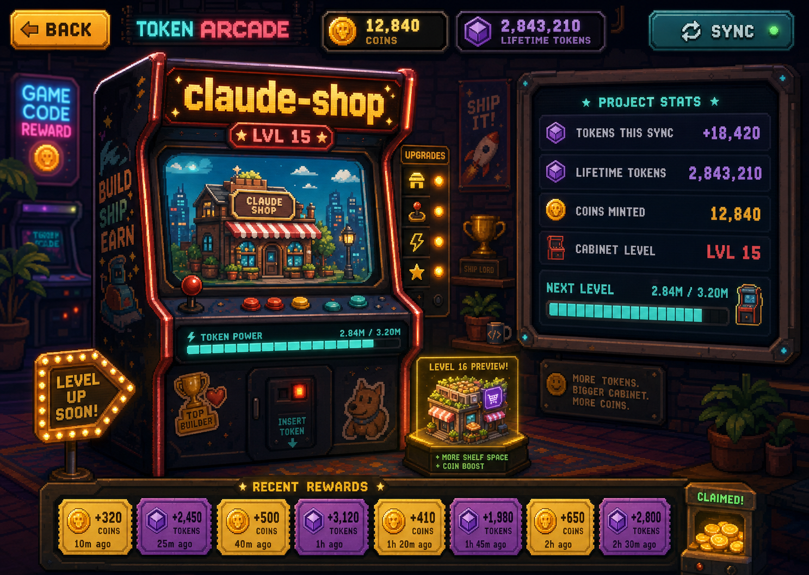

# Visual Prototypes

These prototypes define the visual target for the first playable MVP.

Claude Code owns implementation choices. Preserve the product feeling and screen intent below rather than copying every pixel literally.

## Primary Direction

Use this as the main home-screen target:


Why this direction works:

- It has a player character, so the app feels like a place the user enters.
- The left side is clearly for project cabinets.
- The center is the token-to-coin payoff stage.
- The right side is clearly for prize and collection progress.
- The bottom strip gives coin sinks without feeling like a SaaS navigation bar.

The MVP home screen should feel closer to this than to a traditional dashboard.

See also `VISUAL_QA_ROUND_1.md` for the first implementation review and `VISUAL_ASSET_PLAN.md` for the asset strategy.

## Secondary References

### Sync Reward Moment



Use this for the feeling of a successful sync:

- coins float upward
- cabinet lights turn on
- a short reward message appears
- the coin counter visibly changes

Do not make the default home screen as visually dense as this reference. Treat it as the reward animation mood.

### Project Cabinet Detail



Use this for clicking into one project:

- the selected project becomes a large personal arcade cabinet
- token progress is shown as cabinet power, not a chart
- the next level preview is visible
- recent rewards are small tickets or coin events, not chat history

### Capsule And Prize Wall


Use this for spending coins:

- the capsule machine is the main action
- the prize wall makes unlocked rewards visible
- rarity colors should be readable at a glance
- duplicate handling is secondary and simple

## First Screen Layout

The first screen should use this mental model:

```text
top left: player identity and level
top center: Token Arcade sign
top right: coin balance and settings

left column: project cabinets
center stage: coin bank / token converter / player avatar
right column: prize wall progress
bottom rail: coin sinks and reward shortcuts
```

## Required First-Screen Objects

- player card with avatar, level, and XP/token progress
- project cabinet list with 4-5 projects
- central coin bank or converter
- coin balance
- prize wall preview
- at least three spending options
- settings/help icons

## Interaction Notes

Minimum useful interactions:

- Sync/collect creates a coin reward moment.
- Clicking a project opens its cabinet detail.
- Pulling a capsule spends coins and reveals a collectible.
- Clicking prize wall shows unlocked and locked items.

If time is tight, prioritize the home screen, capsule pull, and persistence over extra screens.

## Visual Rules

- Use pixel-art styling, but keep product text readable.
- Use game objects instead of generic cards when possible.
- Keep panel boundaries clear.
- Keep the palette varied: dark base, gold coins, cyan/teal interfaces, magenta neon, some warm orange/red accents.
- The app must not look like an analytics dashboard with a pixel font.
- Avoid full conversation history, productivity scoring, commits, tests, docs, PRs, or quality metrics.

## Copy Tone

Use short game-like labels:

- `Earn coins`
- `Convert tokens`
- `Pull capsule`
- `Prize wall`
- `Cabinet level`
- `More tokens, bigger cabinet`

Avoid explanatory product copy in the UI. The screen itself should explain the loop.
