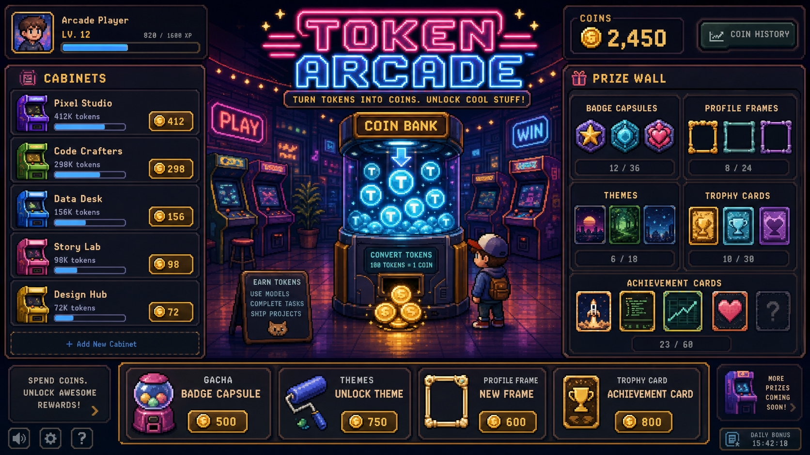

# Visual QA Round 2

Date: 2026-07-08

Evidence was captured during the original browser review. The temporary
screenshot archive was intentionally removed during repository cleanup.

Reference standard:



## Verdict

This pass is a meaningful improvement.

The app now reads as an arcade room instead of a flat pixel dashboard. The generated background, coin bank, prize wall, and cabinet skins are all moving the product toward the intended fantasy.

However, this is not done. It is now visually promising, but it still needs a third pass before it meets the prototype standard.

## What Improved

- The room background adds depth, wall detail, floor reflections, and ambient arcade mood.
- The coin bank is now a real centerpiece instead of a simple procedural object.
- The prize wall has shelf framing and looks more like a collectible display.
- Project cabinets have stronger object identity than before.
- The first screen finally communicates: "you are inside an arcade."

## Remaining Issues

### 1. Reward Feedback Collides With The Marquee

After sync, achievement toasts and the large coin reward text stack over the center marquee and coin bank area. This creates noise exactly where the product needs the cleanest reward moment.

Required change:

- Move achievement toasts away from the center title area.
- Recommended placement: right of the coin bank but left of the prize wall, or a vertical stack near the lower-right room area.
- Coin reward text should appear near the coin bank or coin counter, but not cover the `TOKEN ARCADE` sign.
- The sync moment should feel celebratory, not visually tangled.

### 2. Left Project Area Still Reads Partly Like A List

The cabinet skins are better, but each project is still mostly a row: cabinet thumbnail, text, number, progress bar. It should feel more like a lineup of machines.

Required change:

- Let cabinet art carry more of the row.
- Tighten text into a machine label zone rather than a spreadsheet-like row.
- Reduce the dominance of long green progress bars.
- Add smaller cabinet-level plates, coin glow, or marquee labels.

### 3. Empty First-Run State Is Too Passive

Before sync, the screen shows no cabinets yet and locked prize wall slots. It is understandable, but not exciting.

Required change:

- First-run should still feel playable.
- Use 3 powered-off demo silhouettes or "waiting for tokens" cabinets that look like dormant machines, not empty placeholders.
- The center call to action should feel like inserting a coin into a machine.

### 4. Bottom Spend Rail Feels Detached

The bottom rail is functional, but it feels like a UI toolbar placed on top of a game scene.

Required change:

- Make spend rail feel like an arcade counter or ticket desk.
- Keep buttons readable, but add more physical framing or integrate it with the floor/counter.
- Do not add more text.

### 5. Current Screen Is Stronger Than Before, But Still Not As Rich As The Prototype

The prototype has small environmental details: stools, props, shelves, coin glows, machine bulbs, layered foreground objects. The implementation is cleaner, but still a little sparse.

Required change:

- Add small non-interactive details around the player and coin bank.
- Examples: stool, floor coin glints, tiny ticket stack, cable, cup, small neon sign shape.
- Keep these subtle; do not reduce readability.

## Round 3 Direction

Do not add product features.

Focus only on visual polish:

1. Clean up reward animation placement.
2. Make project cabinets less list-like.
3. Improve first-run empty state.
4. Integrate the bottom spend rail into the arcade environment.
5. Add small environmental props around the center stage.

## Acceptance Criteria For Round 3

- The `TOKEN ARCADE` sign remains readable during sync.
- Reward animations do not cover core navigation or main title.
- Project rows feel like arcade machines first and data rows second.
- The first-run screen is still visually fun before any sync.
- The bottom spend rail feels like part of the room.
- The implementation remains close to `assets/prototypes/primary-arcade-room.png`.

## PM Note

The bar is not "better than before." The bar is:

```text
Would someone seeing this screenshot understand that this is a playful token-powered arcade,
and would they want to press Sync just to watch the room light up?
```
