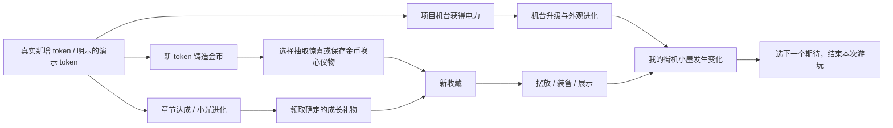

# Token Arcade V2 · 游戏总策划

版本：0.1 / 2026-09-05 / 提案。配套入口：[README](README.md)。

## 1. 游戏定位

**类型：本地、单人、轻量像素养成与收藏游戏。**

玩家是一间私人街机小屋的主人。每个编程项目都是屋里的一台机器；过去与新产生的 token 是机器的电力，也会留下可以花的金币。玩家和一位小伙伴住在这个地方，把抽到和解锁的小物件摆进去，让房间逐渐拥有自己的样子。

“经营”的含义是照料自己的空间和选择收藏方向；首版没有顾客经济、营业额、定价、库存或每日劳动。一次回来可以只待几十秒，也可以花十分钟整理房间。

一句体验承诺：**我在现实里积累的东西，会在这里长成一个可以走进去的小世界。**

### 面向的玩家

- 日常使用 AI 编程，喜欢把长期投入留下可见纪念的人。
- 喜欢像素风、宠物陪伴、收藏和布置，但不想多一个每日任务的人。
- 没有可用 token 历史、希望先试玩的人：完整演示小屋，不伪装真实数据。

不假设用户每天消耗固定数量 token，也不把用量解释为生产力、能力或贡献。

### 五条设计支柱

| 支柱 | 实际要求 | 失败的表现 |
| --- | --- | --- |
| 有一个属于我的地方 | 房间是主舞台，机台是实物，角色在里面活动 | 数字面板围着背景图摆一圈 |
| 成长看得出来 | 轮廓、动作、摆设和灯光发生变化 | 只有数字和进度条增加 |
| 有可期待的下一步 | 一条近期目标，奖励形象可见，获得方式明确 | 满屏红点，不知道为何继续 |
| 我的选择留下痕迹 | 收藏目标、心爱机台、主题和摆放形成个人差异 | 除了抽奖没有选择 |
| 欢迎随时回来 | 不衰减、不催促，长时间没来也保留原样 | 签到、体力、饥饿、过期奖励 |

## 2. 现有版本的玩法问题

这些是基于代码、历史策划和本轮画面的诊断，不是用户研究的统计结论。

1. **有输入输出，缺少关系。** 同步换币再抽奖成立，但项目、收藏和玩家之间缺乏“这是我的”感受。
2. **有等级，缺少下一步的想象。** 等级条不够告诉玩家机器将变成什么、还差多远、回来后能发生什么。
3. **奖励太依赖随机。** 低用量用户可能很久不能抽；已经有币的人反复按抽奖，结果未必改变房间。
4. **展示替代了游玩。** 项目列表和货币栏占据画面，角色只是贴图，房间没有探索和布置的中心地位。
5. **视觉资产没有统一游戏规范。** 宏大霓虹机械、简笔伙伴、网页按钮与不同像素尺度拼在一起。
6. **文档缺少一个总目标。** 历史补丁各自优化页面，数值和范围在文档间漂移。

V2 不靠再加几个数值条解决上述问题，而是让每个系统承担不同的玩家动机。

## 3. 核心循环与玩家选择

房间变化不会反过来产生免费 token 或被动金币。不存在挂机收益的闭环。

### 三个时间层次

| 尺度 | 玩家做什么 | 为什么有意义 |
| --- | --- | --- |
| 10–60 秒 | 回到屋里、收集、看见一台机台升级或一个目标推进 | 每次有新用量都能清楚看到它留下什么 |
| 2–10 分钟 | 拆礼物、抽扭蛋、选择展示物、移动摆设、陪伙伴走走 | 有主动选择和立即可见的结果 |
| 多次回访 | 期待机台阶段、完成章节、形成主题角落、看伙伴进化 | 同一座小屋持续积累个人痕迹 |

以上是游玩时长设计目标，不是获得资源所需的时间，也不对应签到天数。

### 玩家真正作出的选择

- 今天花金币抽惊喜，还是留给确定想要的装饰？
- 哪个项目作为“心爱机台”，放到视觉焦点？
- 展示新拿到的稀有奖品，还是保留更喜欢的小植物？
- 小屋想做成雨夜街机、落日小馆，还是森林里的游戏房？
- 选择一份未来礼物作为愿望，知道下一次回来朝哪里走。

这些选择不改变现实 token 的归属，也不引入成长倍率装备、属性洗点或资源分配的最优解。

## 4. 首次进入与回访脚本

### 无记录的真实新玩家

1. 开门进入一间完成基础布置的小屋：一块空机台位置、储蓄罐、伙伴幼体、空展示位。房间本身有生活气息，不要求先解锁地板和照明才好看。
2. 小光用一句话欢迎：“把你的灵感带进来，我们一起把这里点亮。”
3. 储蓄罐上出现唯一主提示“同步灵感”；可打开简短说明，告知只读取项目 token 汇总。
4. 没有历史时，给出“进入演示小屋 / 再次扫描”两项。选演示前不产生虚构奖励。
5. 切换到独立演示存档，用三次确定的输入演示成长。脚本见数值文档。

### 有大量历史的新玩家

历史应被尊重，不故意从零扣住进度。一次结算全部合法历史，机台直接到真实阶段，章节批量达成。演出只展示最重要的 1 次进化和 1 次获得，其余收进可翻看的收获清单；提供跳过。不得排队播放几十条弹窗。

### 已玩过的玩家

1. 回到离开时的主题、摆设、心爱机台。
2. 伙伴有轻微欢迎动作，未产生资源收益。
3. 一个主目标显示“已可领取”或“还差多少”；没有新 token 时如实显示“都收好了”。
4. 玩家可同步、布置、查看进化预览、换展示物，或直接退出。
5. 下次回来保持选择和布局。不会因长时间没来破坏机器或让伙伴生病。

## 5. 项目机台系统

### 身份与成长

- 机台 ID 绑定项目稳定 ID，而非只用可重复的项目名。
- 项目累计有效 token 决定 Lv.1–50；5 个阶段保持白银、蓝、洋红、紫、琥珀的辨识语言。
- 阶段变化包括整个机身轮廓、顶灯数量、屏幕小场景和装饰结构，不是给旧机身贴一个皇冠。
- 同步新 token 时，受影响机台短暂通电；数值升级与阶段进化采用不同强度反馈。
- 升级不消耗金币，不点“强化”，不掉级。倍率只作用于以后新增 token，详见数值文档。

### 个性与空间

首版：可设一台心爱机台。它获得房间优先展位和一个小心形吊牌，无资源加成。偏好必须持久化；重排只变展示，不变项目 token 归属。

首页近景容量先定 4 台。超出容量以房间内“换一排”操作切换，所有项目可经机台目录访问。不可靠越缩越小把几十个项目塞成数据表。仅有 1 个项目时用宽松摆放和基础摆设补空间，不放 3 个惩罚感强的灰色锁位。

后续扩展：同一等级阶段下的主题外壳、每台机台的纪念摆件、额外展厅。皮肤不能掩盖阶段标识，不提供属性加成。

### 走近机台时

先看到大机台和项目名，再看到当前阶段、下一次外观进化预览、下一级所需 token。货币贡献与来源放到二级信息。只有真实汇总可显示；不生成假历史票据，不展示对话。

## 6. 小光伙伴系统

“小光”是暂定名，身份是一只由小屋电力唤醒的小精灵。首版只有一个可成长的核心伙伴，四阶段：光团幼体 → 小耳精灵 → 星翼精灵 → 冠星精灵。

### 有什么玩法

- 全局累计 token 驱动进化，和机台成长共享输入，但产出是角色动作、体态与陪伴。
- 小光会在合法活动区慢慢移动、跟随店长、停在地毯上；点击会做一个短回应。
- 每次进化解锁一个动作：幼体轻跳；第二阶段跟随；第三阶段短暂盘旋；第四阶段星光庆祝。
- 进化后可选择已解锁外观回看幼体，不改变实际成长阶段。此选择放到 P2，首个切片先验证首次进化。
- 操作可通过对象点击或触摸完成，不要求追着移动目标点。

### 刻意不做

不设亲密度、饥饿、清洁、体力、出游计时和离线寻宝；不通过抚摸次数增加等级。若互动只是一条不变文案也不算完成，要有表情、动作和空间回应。

### 与收藏伙伴的区别

小光是唯一核心养成伙伴。现有猫、宇航员等收藏伙伴是陈列或来访角色，占用伙伴展示位，不再各自增加经验系统。以后可以扩展来客小剧情，但不借此重新搭宠物数值树。

## 7. 章节、愿望与确定奖励

### 章节

章节是永久成长纪念，不是任务清单。首版 7 章，条件只使用全局累计 token。每章有一个具体礼物、一句话生活叙事、预览形象和领取动作。

礼物分工：早期植物和杯子让低用量也有可摆放的变化；中期猫和地毯形成陪伴角落；后期落日与森林主题改变整间房间。完整阈值、重复处理和首导在数值文档中定义。

状态：未达成 → 可领取 → 已领取。无过期、无连续天数。一次导入跨多章，可以“拆开这一份”或“收下全部”；后者必须等价于每章各领取一次。

### 愿望

首个切片默认追踪下一份未领取章节礼物，不加一个需要玩家管理的清单。P2 开放“设为愿望”，最多 1 个主动目标，可以来自下一章、某台机台的下一阶段、确定兑换的收藏。

首页只显示当前最重要的一件事：可领取礼物优先于未达成愿望。领完后恢复愿望。达成不能覆盖玩家布局；新物品先放入库存，再引导摆放。

### 为什么不只做成就

章节承担节奏和确定产出；成就只纪念行为里程碑，不再额外发主资源。成就集继续可看，但不与章节争夺首页的大提醒。

## 8. 扭蛋、收藏与补给

### 扭蛋的角色

给已有金币提供短促惊喜，不承担全部长期动力。首版保留 25 币单抽、225 币十连。拉杆、机器动作、出球、打开、露出物品是一个完整动作链；结果先入账再演出，跳过和刷新都不丢失。

新物品展示名字、用途与“放进小屋 / 稍后”。重复物品简洁显示转为星尘，不播放与首次获得一样长的庆祝。普通小物件也要值得摆，不用把所有好看内容都锁到最高稀有度。

### 收藏必须可用

| 类型 | 回到小屋后的具体用途 |
| --- | --- |
| 徽章 / 招牌 | 挂在展示墙、机台周围的合法挂点 |
| 装饰 / 奖杯 | 放上架、地台或地面陈列位 |
| 收藏伙伴 | 出现在伙伴角落 |
| 相框 | 改变玩家肖像框 |
| 房间主题 | 切换整体场景美术与配套氛围 |

现有 50 个物品保留稳定 ID 和拥有状态。P1 只要求代表样品通过完整美术与摆放验收；未重绘物品使用原始资源，不假装新 50 件已全部精修。

### 确定兑换

现有“按类型随机赠品”不能被包装为“购买这件确定物品”。P1 保持现有逻辑时明确写“随机招牌 / 未拥有的主题”。P2 采用数值文档已列出的六件明确 `collectibleId + price` 的有限常驻货架，购买前看到实际获得物；不做倒计时和每日刷新。

星尘只提供一个简单用途：固定价格换未拥有物，规则必须和实际奖池一致。具体保守基线见数值文档。

## 9. 房间与布置

### 首版空间结构

- 项目展台：4 个近景机位，可换排。
- 储蓄罐：同步与收获的主要舞台。
- 扭蛋角：花金币和获得奖励的主要对象。
- 展示墙 / 小地台：让收藏在主场景里可见。
- 地毯与伙伴区：为店长和小光留出生活空间。
- 入口或工具挂架：成长手册、布置、设置的物件入口。

开放地面留给角色活动。禁止把每个空隙填满统计或按钮。

### 零 token 也能整理什么

基础场景自带 `starter-stool`（木凳）、`starter-lamp`（落地灯）、`starter-planter`（绿植）三件基础摆设。它们是房间定义中的免费道具，不属于 50 件奖品，不计收藏里程碑，不可兑换星尘。必须使用独立对象层，不能全部烘焙到背景里却假装可调。

P1 至少提供三个免费基础布局：`balanced`（默认）、`reading-corner`（窗边小角落）、`open-floor`（中间留空）。零库存玩家能切换并保存这些布局；只改变三件基础道具的合法锚点，不更动玩家已摆收藏。P2 再开放基础物件的自由合法位置。切换布局不花币、不奖励经验，默认布局可随时恢复。

### 布置规则

P1 沿用已有分区系统：墙 4、陈列 4、伙伴 2；保存归一化位置，并允许一键恢复自动摆放。每件收藏首版最多展示一个实例，重复数量不用来无限铺满房间。摆放与收回免费，不出售已解锁物。

操作：进入布置 → 选物品 → 合法位置预览 → 点击落下或拖放 → 保存 / 撤销本次改动。鼠标拖放之外必须有点击选中和点击放置；移动端同等可用。预览显示被占用或越界原因。

新增奖励不会自动覆盖手工布置。首次物品入库给“放到这里”的推荐落点，玩家确认才写布局。关闭编辑器须保留明确的保存 / 放弃规则，不静默保存半成品。

后续增加房间面积、更多锚点或自由网格时迁移布局坐标，不丢弃旧布置。

## 10. 成长节奏与内容生命周期

- 开场：看见一个东西被点亮，收到可摆放的小礼物。
- 早期：确立一个项目的身份，小光第一次变样，出现第一次扭蛋。
- 中期：机台有明显阶段差异，玩家有自己喜欢的展示物，开始考虑主题。
- 后期：高阶段机台、完整主题角落、进化伙伴和长期收藏目标。
- 当前内容完成后：明确“这一册已集齐”，继续布置和收藏；不重置、不转生、不凭空加 500 级拖长数字。

新增内容以“常驻主题册”扩展，例如雨夜、星际、植物。每册带一组物件、匹配摆放位置和一段成长叙事。主题册不撤走老奖励，不新增货币，不要求限时完成。

## 11. V2 范围与非目标

| 必须形成完整闭环 | 首个切片之后 | 暂不进入框架 |
| --- | --- | --- |
| 一间精致小屋、角色、单伙伴 | 更多伙伴动作、可选已解锁外形 | 战斗、多人、排名 |
| token 同步与可见收获 | 常驻主题册、额外房间 | 顾客经营、离线挂机收入 |
| 机台成长、进化预览、心爱机台 | 等级兼容的机台皮肤 | 每日任务、签到、体力 |
| 永久章节礼物、单一下一步 | 主动愿望选择、确定物品货架 | 付费货币、限时抽卡 |
| 抽奖、重复处理、收藏摆放 | 更丰富布局、截图纪念 | 生产力评价、完整历史查看 |
| 模式隔离、存档安全、中文与英文 | 桌面壳、更多来源适配器 | 一开始做插件市场或通用游戏引擎 |

“未来可扩展”指增加主题、物件、场景和数据来源时边界清楚；不是首版实现所有扩展系统。

## 12. 判断是否好玩的验收

使用 5 名未读文档的试玩者进行小样本走查，记录观察，不把小样本当增长指标。

1. 进入 20 秒内，至少 4 人能指出收获入口和一台属于项目的机台。
2. 完成固定演示后，至少 4 人能说出“下次我想得到什么”，而不是只说“再抽一次”。
3. 玩家不经口头指导完成：收获 → 领取 → 摆放 → 退出 → 返回看见物品。
4. 放下新物品之后，至少 4 人能在主场景里直接找到它。
5. 没有新 token 时，仍能完成一次有意义的房间调整，且没有资源被扣。
6. 用户明确评价画面不像网页工具；若这一项失败，暂停扩展系统，先修美术统一性与界面构图。

以上是拟定验收标准，尚未进行试玩，也不声称已通过。
