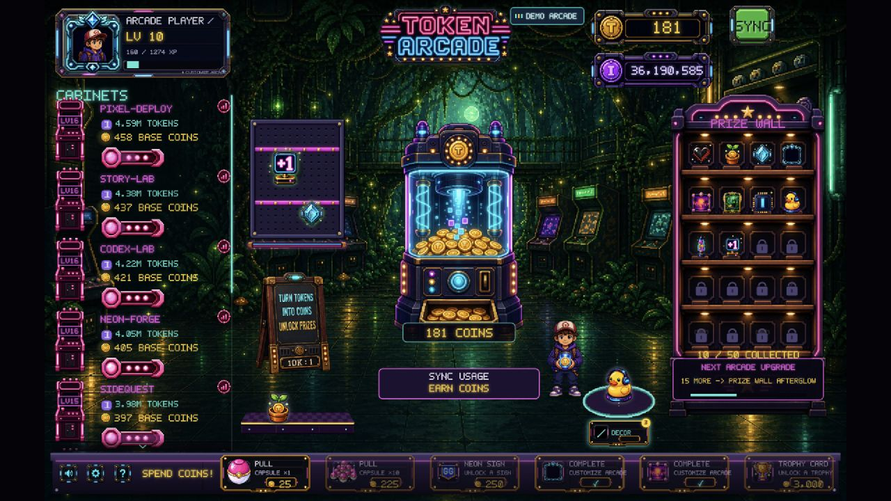
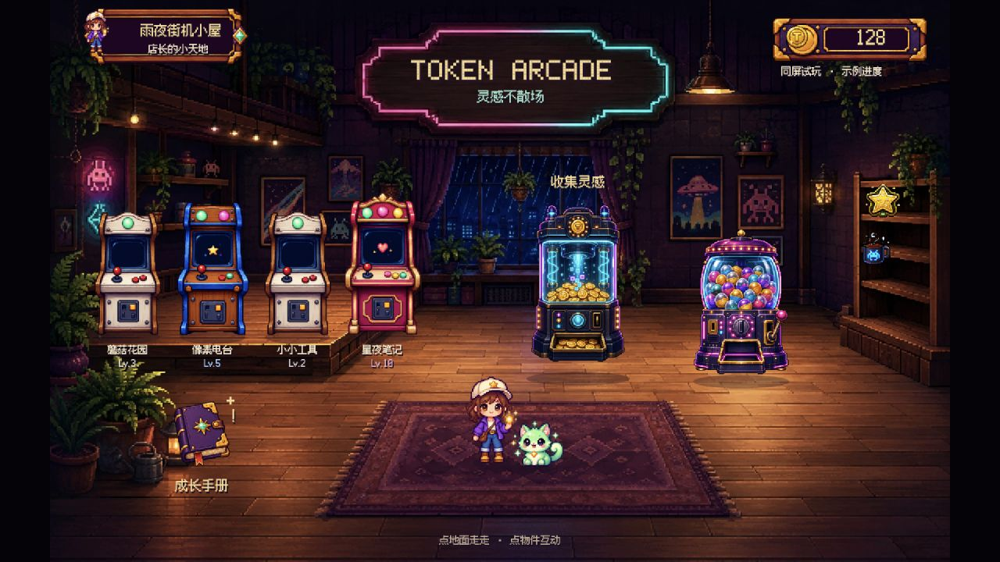
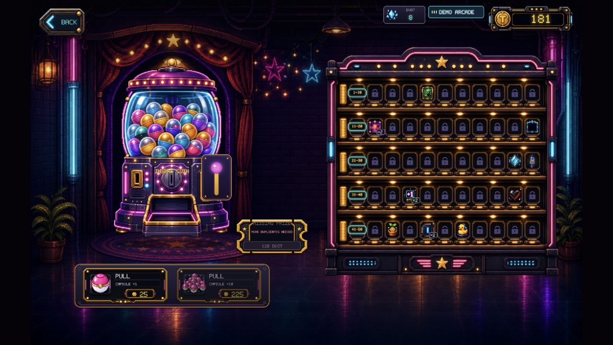
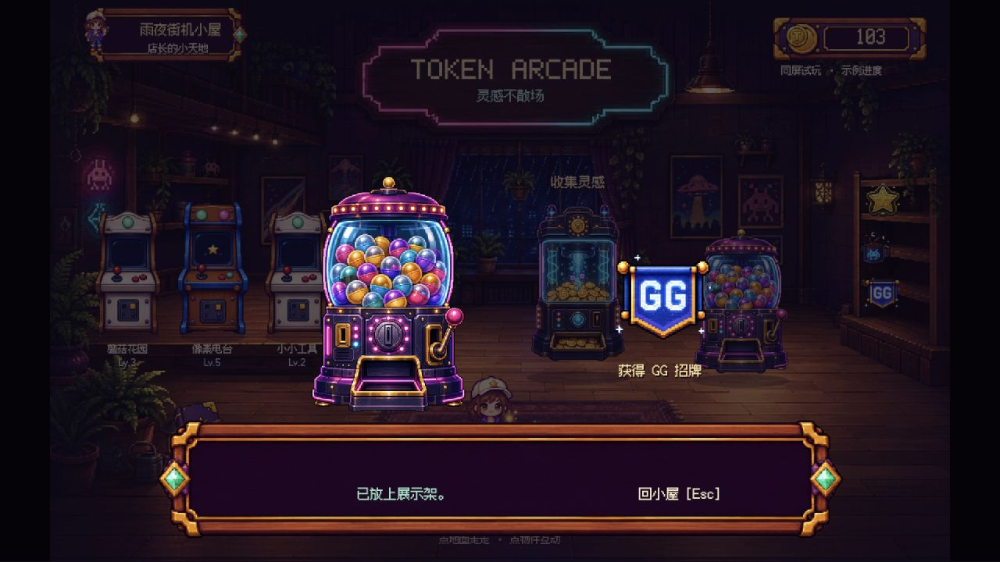
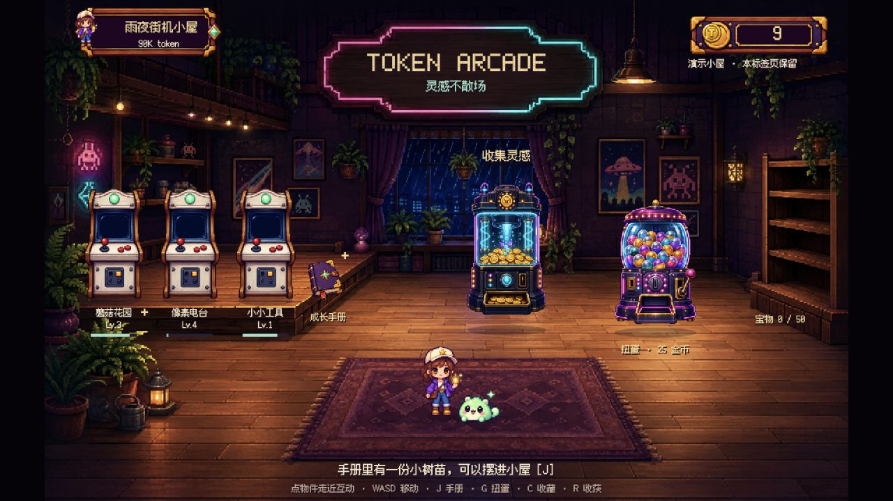
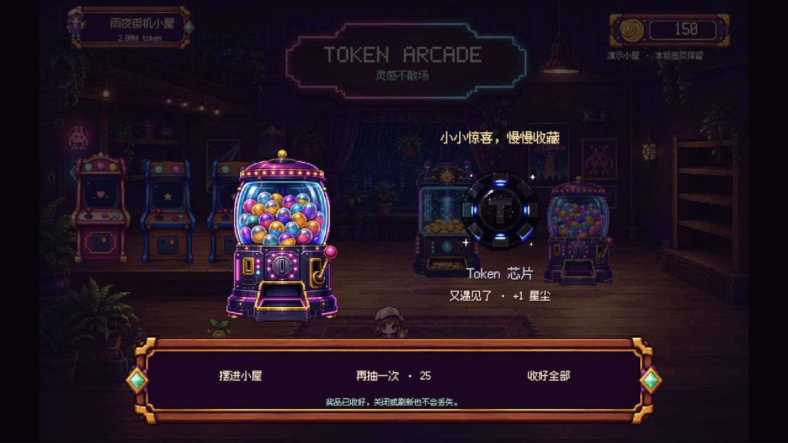

# 布局与互动修订 · 2026-09-06

用户反馈：人物能走、宠物比以前好；房间氛围和机器造型可以保留，但物件布局、操作交互与乐趣弱于重做前的原版街机房间。参照物是仓库 HEAD `a042c3a` 的原房间，不是此前已否决的网页卡片实验。

## 对照审查

本次用隔离本地服务重新运行原版，在应用内浏览器实际查看房间、进入奖励房间并单抽。随后检查当前样板的同一段流程。下图均为本次新捕获，原版只使用虚构演示数据。

1. **房间：原版入口更完整，样板布局退步。** 原版能看到金币用途、收藏数量和成长信息。样板第四台机器越过地台，手册单独落在前景，奖励架几乎没有下一步提示。

2. **奖励流程：原版可继续玩，样板过早结束。** 原版有单抽、十连抽、收藏与重复奖励；样板只能获得一次固定 GG 招牌，随后只剩返回。样板“走近机台”的文字也没有对应真正的走近行为。

3. **养成反馈：应让玩家选择奖励的去处。** 原版收藏架在获得奖励后有变化；样板直接替玩家摆好固定物品，缺少选择。只加可移动角色不能替代奖励、目标与布置。

截图能验证布局、可见入口和结果，但不能证明长期留存、全部动效质量或完整无障碍合规。原版 Canvas 没有完整语义操作列表；样板已有键盘与语义入口，仍需读屏和触屏专项验证。

## 本次具体调整

- 保留雨夜房间、机器画风、可移动店长和小光跟随。机台收为三个实物位置，全部落在地台内，手册放在地台边缘。中心通路与前景活动区空出来。
- 点击物件先规划地面路线，走近后再执行。地面摆设会阻挡路线；WASD 可随时取消自动走路。J/G/C/R 提供手册、扭蛋、收藏与收获的直接快捷入口。
- 收获使用明确的虚构用量，按原有 10K token/币转换。初始 90K token / 9 币；第一次 +160K，得到 16 币，正好可单抽。之后示例会话 +250K、+500K、+1M，之后每次 +1M。不是实际历史，不改变真实项目归属。
- 机台等级及伙伴形态从示例 token 派生，不再点击宠物直接切换成长阶段。点击小光只回应，不刷资源。
- 前三章植物、马克杯、猫礼物有真实领取状态；只能领取一次。领完可以选择摆放位置，或以后重新摆放。
- 恢复已有 50 件奖池及其稀有度权重、25/225 抽奖价格。可以连续单抽或十连；拉杆可点，胶囊可手动点开；奖励可逐件查看、收好全部或马上展示。
- 重复收藏保留数量，使用原有 1/2/3/5/10 星尘补偿；120 星尘可换一个随机未拥有收藏。
- 收藏册可翻阅全部 50 件，区分已拥有和未拥有，并重新布置已拥有物。替换位置不会删除原收藏。
- 展示位按用途限制：小件放架子、伙伴和大件放地面、招牌/徽章可上墙。房间主题和头像框在这一轮仅能作为收藏纪念展示，不是正式换肤实现。
- 一条底部提示随状态变成“去收获 / 领礼物 / 找位置 / 继续收藏”。进入近景时隐藏房间里的文字标签，避免背后文字干扰。

## 保存范围

`src/preview/progress.ts` 是独立试玩模型，仍不接 `GameStore` 或 usage API。状态只写当前标签页 `sessionStorage` 的 `token-arcade:cozy-playtest:v2`，不读写原应用的 localStorage 存档。刷新保留金币、收藏、布置和未看完的结果；关掉标签页后的恢复不作为承诺。

抽奖先把扣费、收藏和待揭晓结果一起写入试玩状态，再演出。待揭晓结果阻止重复扣款；刷新会恢复结果。这只验证独立试玩流程，不意味着正式存档事务、真实同步高水位和多标签锁已经完成。

## 验证记录

- `npm run typecheck` 与预览构建通过。
- `npm test` 共 149 项通过：新增用例覆盖首次收获/章节、待揭晓防重入与恢复、十连及重复补偿、摆放库存、星尘兑换、非法存档、寻路避开地面摆设。
- 应用内浏览器实际操作：走近储蓄罐后 9 → 25 币；打开手册领取植物并选择位置；刷新保留；单抽 25 → 0 币；揭晓后刷新仍保留奖品且不再扣币；钱不足可回房间收获；浏览收藏册。
- 后续实际核对：点击机身拉杆 175 → 150 币；点击胶囊看到重复 Token 芯片及 +1 星尘；十连 250 → 25 币，并能从第 1 件翻到第 2 件、收好全部；第二章杯子领取后只出现三个展示架位置。
- `scripts/verify-cozy-preview.mjs` 已按新流程更新并通过语法检查；本轮没有重新运行外部 Chrome 自动化脚本，不沿用旧版的“12 项浏览器自动检查通过”结论。
- 本轮的源截图和后续最终截图存放在 `screenshots/interaction-review/`。

后续仍需用户实际判断“是否更好玩”。真实同步、完整七章、四方向动画、正式主题与头像框、多项目换排，以及小屏兼容仍属于后续制作范围，不把这一轮称为完整 V2。
