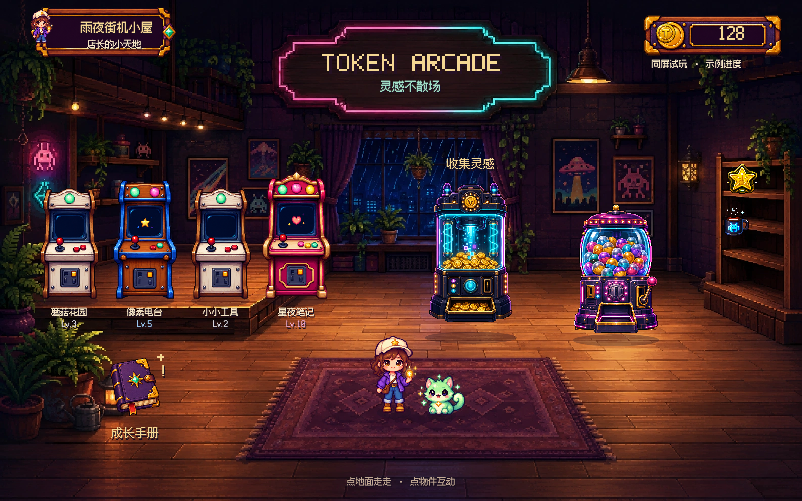
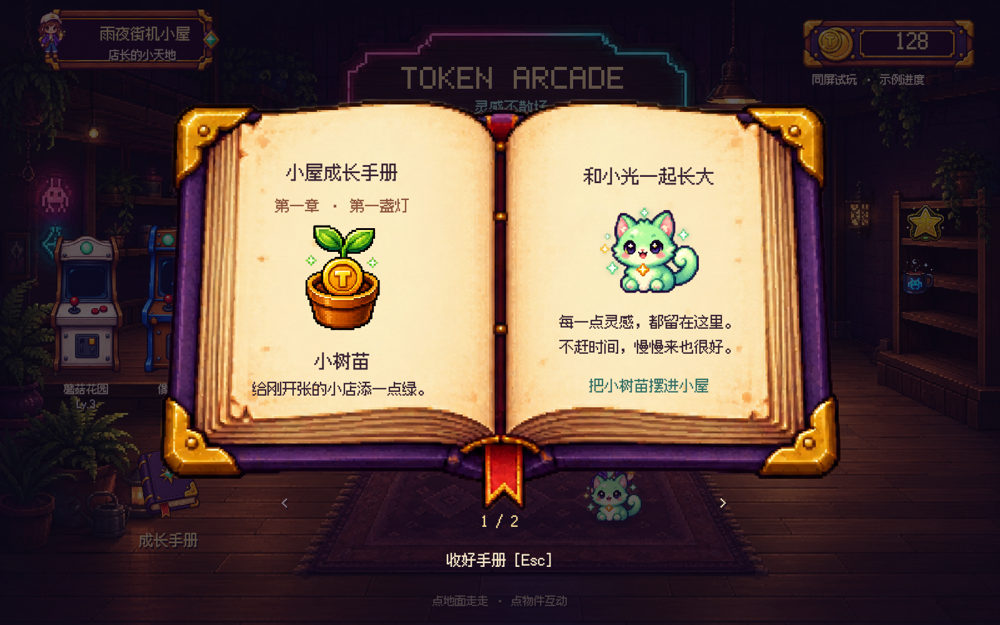

# P1-A · 雨夜街机小屋同屏样板

> 历史记录：下文描述 9 月 5 日的初版。用户随后认可人物、宠物及房间氛围，但指出布局与操作乐趣退步。当前 `/cozy.html` 已按 [9 月 6 日布局与互动修订](INTERACTION_REVISION.md) 更新；下文的一次性扭蛋、纯内存状态与旧测试数字不再描述当前版本。

日期：2026-09-05。状态：**已实现可交互桌面样板，待用户评价视觉；不是完整 V2，也不代表美术已经获认可。**

用户在策划落盘后要求继续推进。本次按策划制作房间同屏样板，先把场景、角色、机台、伙伴、文字和手册放在一起，验证游戏质感。

## 入口与运行

运行 `npm run build`，然后 `npm start`，打开 <http://localhost:4173/cozy.html>。默认首页仍是既有应用；这个独立入口不接真实 token 历史。

源文件为 `src/preview.ts`、`public/cozy.html`。`npm run build:preview` 可单独重建样板。运行素材已经保存在仓库，浏览器无需请求外部服务。

## 这一版可以体验什么

| 操作 | 画面与行为 |
| --- | --- |
| 点击地面、方向键或 WASD | 店长在前景行走，小光跟随；本样板的活动区是地毯及附近地面 |
| 点击项目机台 | 放大查看机台、项目名、等级和下一级进度 |
| 点击储蓄罐 | 示例金币增加 12，第一台机台成长，小光切换形态，播放收获反馈 |
| 点击地上的手册或按 J | 打开像素双页书；翻页看植物和猫礼物；可把植物摆进房间 |
| 点击扭蛋机 | 花 25 示例金币获得 GG 招牌，招牌出现在展示架；本次会话限一次 |
| 点击小光 | 打招呼、预览四种成长形态 |
| 点击左上身份牌 | 切换中英文和声音 |
| Tab / Enter / Esc | 选择物件、互动、返回；弹窗隔离背景点击和移动 |

## 已落实的视觉约束

- 主体是完整房间，左侧项目机台、中间收集装置、右侧扭蛋与展示架、前景角色共同构成游戏空间。
- 字体、书册、对话框和物件使用像素视觉；动态文字由程序绘制，素材不烘焙项目名、钱包和状态。
- 机台使用阶段素材，角色与伙伴使用透明独立层。对话框保留端部比例，仅扩展中段。
- 房间使用暖木色、深紫阴影、薄荷绿和少量粉色灯光。页面不设置网页导航、功能卡片网格或统计表。
- 字体本地加载，采用 Fusion Pixel 12px 简体中文比例字体；来源和 OFL 许可见 `public/assets/fonts/README.md`。

## 数据边界

本入口不导入 `GameStore`，不请求 usage API，不写 localStorage。全部角色、金币、项目和礼物状态只存在样板内存中，刷新恢复示例。

样板每次收获增加 110K 示例 token、12 示例金币，并切换伙伴外形，这是视觉触发器，**不用于证明 V2 数值、同步或伙伴成长规则正确**。真实经济、幂等结算、存档恢复和固定三次演示属于 P1-B。

测试通过只说明本样板未触碰测试浏览器中的既有存储，不代表旧主应用的已知交易缺陷已修复。

## 素材与复现

- `assets/concepts/v2/` 保留四张生成研究图及完整提示词索引；提示词见 [ASSET_PROMPTS.md](ASSET_PROMPTS.md)。
- `node scripts/prepare-cozy-preview.mjs` 仅进行保留透明通道的裁切、边界整理和房间格式转换，产出 `public/assets/cozy-preview/`。
- `atlas.json` 记录每张素材的源图、裁切坐标和脚底锚点。当前图仍是候选，不是批准的量产资源。
- 储蓄罐、扭蛋机及小型收藏暂用已有素材。这些素材的高光与新房间仍有差别，后续应按同屏反馈统一。

## 验证与待办

浏览器脚本：`node scripts/verify-cozy-preview.mjs`，需要本地服务和系统 Chrome。脚本实际点击画面，不通过调试 API 代替用户动作；只读 `cozyPreview.snapshot()` 用于断言。

覆盖行走、弹窗隔离、奖励摆放、翻页、收获、扭蛋扣费、语言、存储与网络隔离、刷新、键盘焦点、减少动效、页面及资源错误。截图覆盖 1600×1000、1440×900、1280×800 桌面比例。

2026-09-05 实测：12 项浏览器检查通过，明细见 [p1a-checks.json](screenshots/p1a-checks.json)；`npm run typecheck`、`npm run build`、`git diff --check` 通过；`npm test` 共 142 项通过、0 失败；npm 打包清单包含样板、运行素材、字体和许可。不能把通过用例扩大为所有设备兼容。

尚未完成：手机竖屏、四方向完整角色动画、统一原生像素网格、真实空间碰撞与到达物件后互动、扭蛋完整演出、正式领域命令与存档接入、七章手册和完整装饰系统。当前固定逻辑画布按视口缩放，小尺寸与高 DPI 的像素一致性仍需专项打磨。

P1-A 的下一判断是整体画风是否成立。用户视觉反馈写入决策后，再决定如何把样板迁入正式场景；P1-B 按 [DELIVERY_PLAN.md](DELIVERY_PLAN.md) 先修结算和存档边界。
