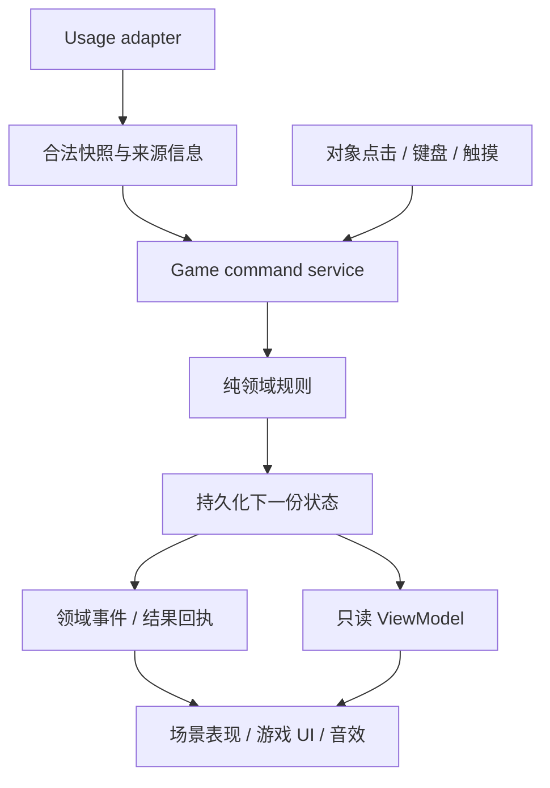

# 程序架构与扩展约定

版本：0.1 / 设计提案。本文是从 [游戏总策划](GAME_DESIGN.md) 推导的技术方向，不表示已经重构完成。

## 1. 架构选择

先保留 TypeScript、本地 Node 服务、Canvas 渲染和已有内容/领域分层。V2 第一目标是证明一间小屋的玩法与美术，不为了“游戏”二字立即换引擎。

当前架构能承载单场景角色移动、精灵动画、命中测试和本地状态。先补场景对象、命令事务、数据驱动内容和可访问交互四个明确边界。暂不引入 ECS、网络联机框架、通用插件系统和云端账户。

若同屏样板证明现有渲染在相机、动画、输入与性能上持续重复造引擎，再用独立 ADR 比较引擎迁移；保持下面的领域状态和内容 ID 不变。技术选择需要可玩性证据，不能先用“未来扩展”作为换框架的理由。

## 2. 现状与需要补齐的边界

| 层 | 现有结构 | V2 演进 |
| --- | --- | --- |
| 输入 | `data/liveSource.ts`、`mockSource.ts`，服务器扫描 | 统一 UsageSnapshot 契约，标明来源、项目 ID、计数语义和版本 |
| 领域 | `domain/sync.ts`、economy、levels、collection 等 | 加章节资格/领取、伙伴派生状态；修结算高水位；与绘制完全分离 |
| 内容 | collectibles、rarities、shop、achievements | 章节、主题册、伙伴阶段、房间定义使用稳定 ID 和配置 |
| 状态 | GameStore + localStorage，模式分槽 | Command 串行化、跨标签协调、版本迁移、备份/恢复与错误反馈 |
| 绘制 | 每页 Canvas 和 Stage 热区 | 房间 Scene + 实体对象 + 动画组件 + 共享游戏 UI；剥离巨型单页方法 |
| UI | Canvas + 帮助设置 DOM | 可见像素游戏 UI；隐藏语义层统一绑定命令，不使用网页样式替代美术 |

## 3. 最小可扩展模块

```text
src/
  core/            稳定类型、命令与事件契约
  content/         collectible / chapter / companion / room / theme-pack 定义
  domain/          纯规则：tokens、coins、levels、eligibility、placement
  data/            usage adapters；live 与 scripted-demo 同一契约
  state/           command service、save repository、migrations
  game/
    scene/         RoomScene、对象注册、落地排序、相机、区域
    actors/        玩家移动、伙伴跟随、精灵动画；不产资源
    interactions/  hit areas、focus、pointer/keyboard/touch 统一动作
  render/          asset atlas、pixel drawing、effects、audio
  screens/         房间、机台近景、扭蛋近景、手册、布置的编排
  ui/              游戏 UI 状态、语义 DOM、基础设置
```

目录是职责目标，可以逐段迁移，不要求一次搬完全部旧文件。禁止新文件只是换目录而继续直接改任意全局 state。

### 数据与表现的单向关系



结果先合法提交，演出再播放。动画结束不能调用“补发奖品”；否则刷新、跳过或返回会把资源逻辑绑在帧率上。

## 4. 命令与事件契约

| 命令 | 主要校验 | 提交后的结果 |
| --- | --- | --- |
| SyncUsage | 来源有效、token 有限非负、稳定 ID、未结算区间 | TokensDiscovered / CoinsMinted / CabinetLeveled / CompanionEvolved / ChaptersAvailable |
| ClaimChapter | chapter 存在、阈值达成、尚未领取 | ChapterClaimed / CollectibleGranted 或 DuplicateConverted |
| ClaimAvailableChapters | 只处理请求时有效且未领项，各 ID 去重 | 单次提交，结果等价于逐章领取 |
| PullCapsule | count 仅 1 或 10、余额足够、完整奖池 | CoinsSpent / CollectibleGranted / DuplicateConverted |
| ExchangeMissing | 星尘足够、至少有一个有效未拥有项 | DustSpent / CollectibleGranted |
| BuyOffer | offer 存在、价格版本匹配、物品存在、可购买 | 确定物品或已明确的类型随机赠品 |
| FeatureCabinet | 项目属于当前槽、可找到 | FeaturedCabinetChanged |
| EquipCosmetic | 类型匹配、确实拥有或默认项 | CosmeticEquipped |
| SaveRoomLayout | 拥有、分区、容量、坐标合法 | RoomLayoutSaved |

演出事件至少带 `commandId`、`saveRevision`、对象 ID、before/after 必要字段。UI 不从 toast 文本反推状态。

用户动作只走命令服务。包括手册、Canvas 按钮、调试入口、可访问层，都不各自实现扣币/发奖。

## 5. 持久化与迁移

### 新字段的职责（拟议，不等于当前实验字段定稿）

```text
schemaVersion
revision
mode
projectsById / project display metadata
creditedHighWaterByProject
wallet { coins, dust, coinResidue }
progress { claimedChapterIds, collectionCompletions }
identity { featuredProjectId, selectedCompanionForm, equippedCosmetics }
roomLayout { roomId, layoutVersion, starterPresetId, placements }
presentation { pendingRewardReceipt, lastSeenEvolution }
demo { scenarioVersion, step, seed }   // 只属于 demo 槽
```

已有字段可保留，先由迁移和选择器适配，不为整洁强制重写全部存档。新版字段上线需正式迁移测试；当前 `SAVE_VERSION=2` 加默认值的实验不足以覆盖交易、快照和布局升级。

### 必须保证

- live/demo 永不共享 wallet、章节领取、项目、伙伴成长、布局和抽奖结果。音量、语言可以共享。
- 所有资源变更有原子边界。在当前 localStorage 路线下，同标签单队列；同源跨标签使用 Web Locks 协调，并在锁内重新读取最新 revision 后校验、提交。
- Web Locks 不可用时，首个发布切片**禁止资源与布局写入，进入只读模式并提示此环境不支持安全保存**；仍可预览和导出现有存档。不能把 localStorage 标记、心跳或 BroadcastChannel 宣称为可靠主标签选举。未来确需支持该环境，再实现经并发测试的 IndexedDB 事务存储回退，不能留下不成立的“单写模式”承诺。
- `storage` 事件用于刷新显示，不能单独当作避免双领奖和丢币的互斥机制。
- 获取真实快照可以在锁外；最终计算必须在锁内对最新状态执行。异步请求记录来源槽与 generation，切换模式后旧请求只能提交原槽或丢弃，不能写进新槽。
- 页面显示提交成功前必须确认持久化成功；quota/权限失败不可被静默吞掉。未提交结果按下面的单一状态机保留，不把未保存余额冒充已到账。
- 首次迁移保留原存档副本；迁移可重复执行，不二次减币、不二次发奖。
- 未知新版本先进入恢复/只读提示，不能默认 fresh state 覆写原记录。
- 同一个章节领取、抽奖或购买操作的 `commandId` 在重试时复用；不能刷新后随机生成新 ID 重放上一笔。

本方案只保留需要恢复的有限最近回执，不建设无限事件溯源日志。`pendingRewardReceipt` 支持抽到物品后刷新仍能看见真实结果；是否已看过演出不影响拥有状态。

### 保存失败状态机

```text
ready → preparing（锁内读最新状态、校验、生成唯一结果）
      → committed（写入成功，更新可用状态，播放结果）
      → save-failed（写入失败，保留待处理 nextState + commandId + 随机结果）
save-failed → retrying → committed / save-failed
save-failed → explicit-discard → ready（恢复上一份已保存状态）
```

失败时显示“这次收获尚未保存”。可见可用钱包保持上一份已保存值；待处理结果仅在恢复窗口预览，不可用于下一次抽奖/领奖。暂停所有资源、布局和模式切换命令；查看页面/导出旧状态仍可用。

“重试保存”复用同一 commandId 与随机结果，不重新抽取。若重试时发现其他标签已写新 revision，不能以旧 nextState 覆盖：将这笔未提交操作标记冲突，显示未扣费/未发奖，要求放弃待处理版本并重新发起新动作；没有落盘就不宣称已获得。首次失败需把原 revision 与随机结果一并留作诊断。

关闭页面会丢失未持久化的内存结果，必须说明，不承诺刷新恢复。提供“导出恢复包”（原 revision、已保存快照、待处理 command/result，明确非正式存档）和“放弃本次操作”选项；导入恢复包需重新核对当前 revision，不能直接重复加库存。正常关闭不阻止玩家退出；打开失败窗口时只提示实际未保存状态。

### 老存档迁移准则

1. 保存原始副本并识别 schema。
2. 保留币、尘、收藏、成就和装备；机台 level/阶段由有效 token 重新派生。
3. 新章节默认未领取，只计算资格；核心伙伴由已有累计 token 派生。
4. 用旧有效高水位和最后结算记录建立保守 creditedHighWater，不倒推额外补币。
5. 保留合法手工布局；已删除/未拥有物放回库存说明，不静默丢失其余摆放。
6. 校验后提交新 schema；失败仍可读取备份。

## 6. 内容扩展协议

| 新增内容 | 要提供的数据/资源 | 不应修改的核心代码 |
| --- | --- | --- |
| 收藏物 | id、type、rarity、名称描述 key、assetId、可放分区、contentPackId | 扣币、发奖、存档写法 |
| 新章节 | id、tokenThreshold、rewardId、文案、演出 key | 领取状态机、重复检测 |
| 新伙伴形态 | stageId、tokenThreshold、atlas/clip、动作引用 | token 结算 |
| 新房间 | roomId、背景、相机边界、机位、可走区、摆放区、布局版本映射 | wallet 与历史读取 |
| 新主题册 | packId、永久目录 ID 集合、奖励与完成定义 | 既有图鉴毕业纪念 |
| 新 token 来源 | Adapter 返回合法聚合快照、稳定项目 ID、源计数语义 | 所有游戏页面 |

内容加载时校验：ID 唯一；奖励引用存在；稀有度权重合法；章节门槛递增；物品可放分区与类型匹配；资源可解码；翻译完整。配置错误应在构建/内容验收时暴露，不在玩家点击领取后扣了币才失败。

### 主题册的兼容性

收藏完成以 pack 的固定 ID 集合和完成记录定义。后加内容使用新 pack/version，不改变旧册的“已集齐”。不把目录长度直接当所有永久里程碑的分母。

已发布奖励 ID 不复用；下架物保留墓碑定义，以便旧存档继续显示拥有和摆放。现阶段无需运行时第三方脚本插件。

## 7. 房间场景与角色

每个实体至少有 `id, position, depthAnchor, visual, interaction`。机台实体额外引用 projectId；布局实体引用 collectibleId。绘制按脚底/深度排序，UI 独立层绘制。

角色输入先经 walkable 区域与障碍校验；伙伴跟随是纯表现。跟随目标不能穿过机台、挡住主要操作或走出可达地面。远离玩家后可走到附近可达点，首个小房间不需要复杂导航网格。

主题切换使用同版本房间锚点与可走区；若结构变化，必须有 layoutVersion 映射。不能仅替换背景图但让旧家具浮在墙上。

当前装饰系统的归一化分区坐标可继续使用。扩展自由网格前先完成输入和持久化；不要顺手实现任意缩放、旋转、复制、售卖等额外系统。

## 8. 游戏 UI 与语义层

把按钮定义成同一份“可执行动作”：label、状态、可用原因、command、focus target。Canvas 绘制与语义 DOM 从该定义派生。语言切换更新两者；DOM 无权独立改变资源。

当手册/对话框打开，屏蔽底下房间移动和命中；关闭后焦点回到原物件。Esc 逐层返回，不同时关闭两层或丢弃未保存布局。

首个 UI 样板可以用 Canvas 或 DOM 实现，但必须符合像素美术规范。技术载体不决定外观；禁止拿普通网页弹窗顶替游戏内书册。

## 9. 性能、资源与降级

- 保留现有 auto 30fps 静态基线 / 60fps 交互能力，按真实测试确认移动和拖放表现。
- 静态背景缓存；动态对象和特效有预算，不因随机闪灯持续全屏高负载。
- 暂停后台动画；恢复后 dt 截断，不产生离线收益。
- 精灵预加载按房间依赖清单；加载失败有同风格占位和可操作入口，不白屏。
- PNG alpha 检查、实际采样缩放、atlas 边界检查属于构建验证。
- 字体本地化、许可证记录；生产运行不依赖 Google Fonts。
- 主目录资源需随 npm 包一起发布；概念图与生成源文件不自动装进运行包。

## 10. 测试层级

| 层级 | 必测内容 |
| --- | --- |
| 纯规则 | token/币余量、倍率、50 级边界、四阶段伙伴、章节资格、重复补偿、非法数值 |
| 状态/交易 | 重复 command、连点、双标签、模式切换中同步、存储失败、迁移可重复、未知版本恢复 |
| 内容 | ID/引用/翻译/asset/atlas 校验、物品用途、pack 完成兼容 |
| 浏览器闭环 | 同步→章节→领奖→摆放→抽奖→刷新，必须真实点击，不能失败后调用 store 充当通过 |
| 视觉/交互 | 1/4/20 项目，长名称，中英文，小屏、键盘、减少动态、加载失败、主题切换 |

现有测试通过只是“没有破坏已覆盖规则”，不能据此声称新玩法或像素美术已验收。
